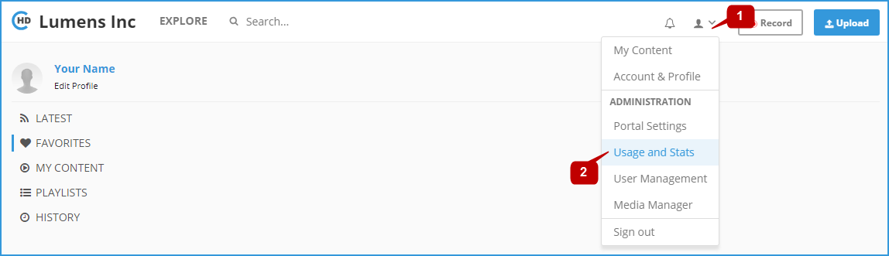
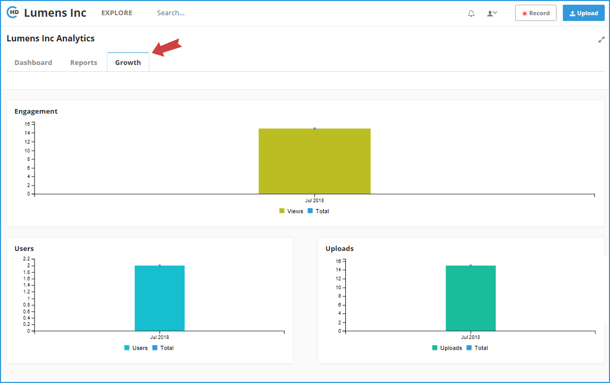

# How to Monitor The System Usage And Growth?

Usage and Statistics are available to Portal Admins only. If you are an Admin, please click on the \[**Usage and Stats**\] option in the drop-down menu.

Click on the "**Growth**" tab to open the **Portal Growth Page**:

in the growth page you can monitor the portal usage by evaluating the engagement level, users actions, and uploaded videos rate.

