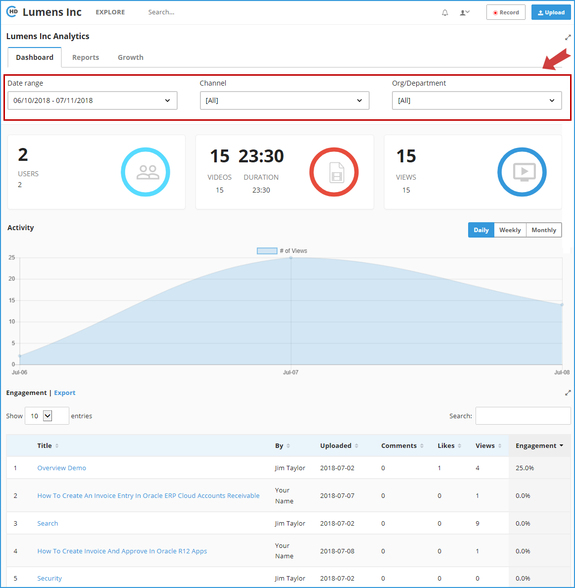

# How to Open System Dashboard?

Usage and Statistics are available to Portal Admins only. If you are an Admin, please click on the \[**Usage and Stats**\] option in the drop-down menu.

The below **Analytics Page** will be opened:

* On the Dashboard page, you can change the date range by clicking on the date drop down in the top left and selecting the range. 
* The report shows a breakdown of Users, Videos, Engagement and also a list each video with its recent view activity. You can search for a specific video file by using the search box within the report. 
* Scroll below to view the Top Popular videos and searches on your CircleHD Portal.

