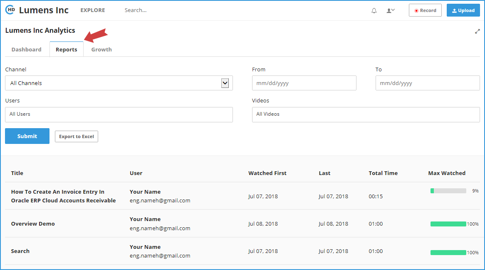

# How to Open System Reports?

Usage and Statistics are available to Portal Admins only. If you are an Admin, please click on the \[Usage and Stats\] option in the drop-down menu.

Click on the "**Reports**" tab to open the **Portal Reports Page**:

* On the Reports page, you can change the Channel, From/To dates, users, and videos, then click on the "**Submit**" button to regenerate the report. 
* Click on the "**Export to Excel**" button to export the report data to an excel file.

