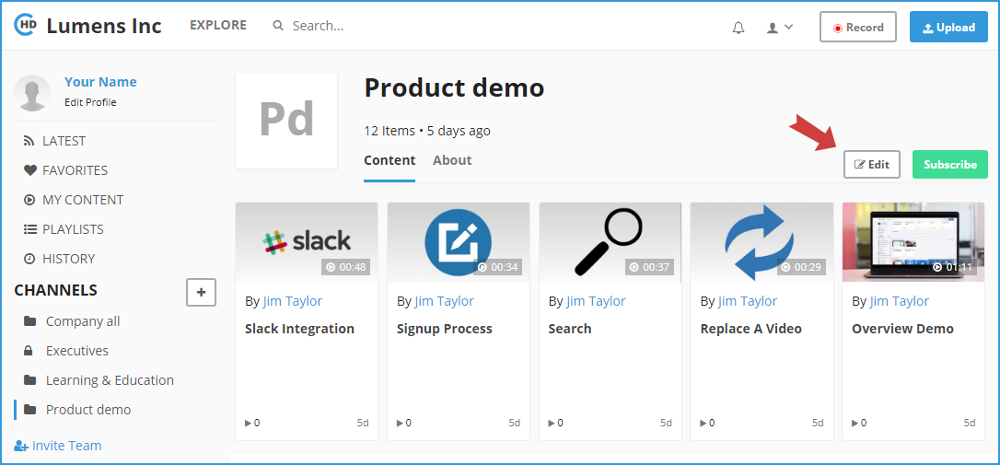

# How to add users to a Channel?

**1-** Channel creator will also be the Channel Owner, you can add another co-owner by following below steps.

In the left vertical navigation, click on the required Channel directly to load the Channel Page, or click on the “**Explore**” link in the top header, then tap on the channel name. 

**2-** Click on the “**Edit**” button in the right.

**3-** The **Edit Channel Page** will be opened as below:

**4-** Add users directly in the bottom "Members" box. changes on the channel definition, and then click on the "**Save**" button when finish.

**5-** For security settings, you can select option “All users can view” if you need all portal users to view the channel. By disabling it, you can provide view access to specific users and their emails can be entered below in the list box.

Similarly, you can provide upload access to all or specific users who can be entered in the list box. Note that, if all users are given upload access, they would automatically have view access.Click on “Create” button once all details are entered. You will be able to add existing or new videos to this channel by editing the video and assigning it one or more Channel\(s\).

