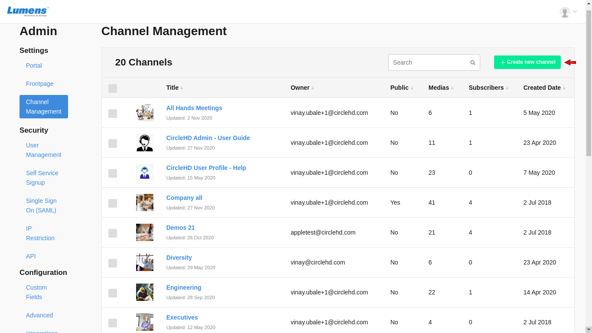
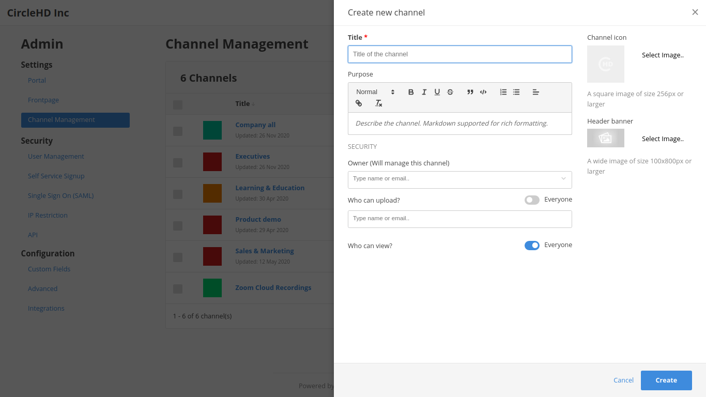

# How to Create New Channel?

You can add channel in two ways:

**1-** Click on the “**Channels**” text in left vertical navigation and then "**Channel Manager**"

**2-** Click on the “**Portal Settings**” link and then click on "**Channel Management**" and "**Create New Channel"** Option:

**3-** The below "**Create Channel**" form will be opened:

**- Channel Icon and Header Banner:** You can choose a thumbnail image for the channel by clicking on “Choose an icon”, square image of 256px or higher is preferred. Similar option for Header Banner.

**- Title:** enter the title for the channel 

**- Purpose:** enter purpose or description if needed to provide more details on the channel 

**- Owner:** as a Channel creator, you would automatically become another Channel owner 

**- Security Mode:** 

* A Channel can be **public**, where every user within that organization can access it or it can be **Private** for limited users. 
* You can control the security options on your channels by selecting the "**Everyone can view**" and "**Everyone can upload**" options as below:

_**Public Channel:**_ 

Set the option "**Everyone can view**" to true in order to define the channel as Public and enable everyone within the organization to view any video within this Channel. 

Set the option "**Everyone can upload**" to true in order to allow other users to upload new videos into your channel, or set it to false to prevent all users to upload new videos into your channel.

_**Private Channel:**_ 

Set the option "**Everyone can view**" to false in order to define the channel as Private and prevent everyone within the organization to view any video within this Channel. 

Set the option "**Everyone can view**" to false enables option 'Restrict By Access Control \(SSO\)'. 

**-**Click on the "**Create**" button when finish.

