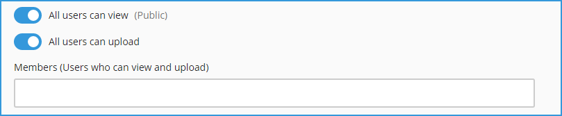
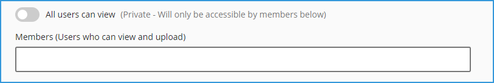

# How to Create New Channel?

You can add channel in two ways:

**1-** Click on the “**+**” icon next to “**Channels**” text in left vertical navigation:

**2-** Click on the “**Explore**” link and then clicking on "**+ Channel**" button on the top right:

**3-** The below "**Create Channel**" page will be opened:

**- Channel Icon:** You can choose a thumbnail image for the channel by clicking on “Choose an icon”, square image of 256px or higher is preferred **\[1\]** 

**- Title:** enter the title for the channel **\[2\]** 

**- Purpose:** enter purpose or description if needed to provide more details on the channel **\[3\]** 

**- Owner:** as a Channel creator, you would automatically become another Channel owner **\[4\]** 

**- Security Mode:** **\[5\]**

* A Channel can be **public**, where every user within that organization can access it or it can be **Private** for limited users. 
* You can control the security options on your channels by selecting the "**All users can view**" and "**All users can upload**" options as below:

_**Public Channel:**_ 

Set the option "**All users can view**" to true in order to define the channel as Public and enable everyone within the organization to view any video within this Channel. 

Set the option "**All users can upload**" to true in order to allow other users to upload new videos into your channel, or set it to false to prevent all users to upload new videos into your channel except those listed in the "**Members**" area.

_**Private Channel:**_ 

Set the option "**All users can view**" to false in order to define the channel as Private and prevent everyone within the organization to view any video within this Channel. 

You can also specify the users in the "**Members**" area who can view and upload new videos into your private channel.

**-** Click on the "**Create**" button **\[6\]** when finish.

