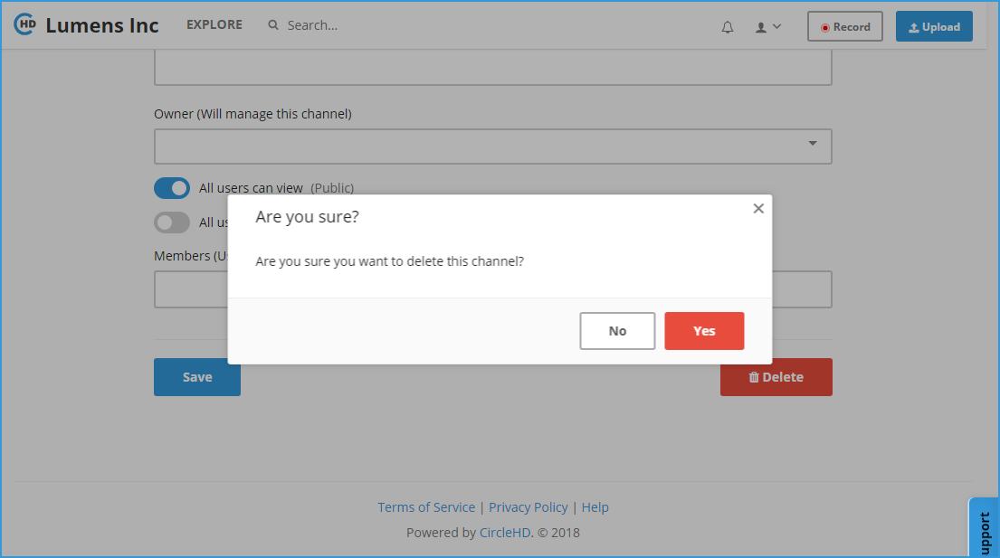

# How To Delete Channel?

**1-** In the left vertical navigation, click on the required Channel directly to load the Channel Page, or click on the “**Explore**” link in the top header, then tap on the channel name. 

**2-** Click on the “**Edit**” button in the right.

**3-** The **Edit Channel Page** will be opened as below:

**4-** Scroll at the bottom, on the bottom right there is “**Delete**” button. You can click this button to delete the channel. You will be asked to confirm if you want to continue to delete, please click “**Yes**” to continue with deletion.

