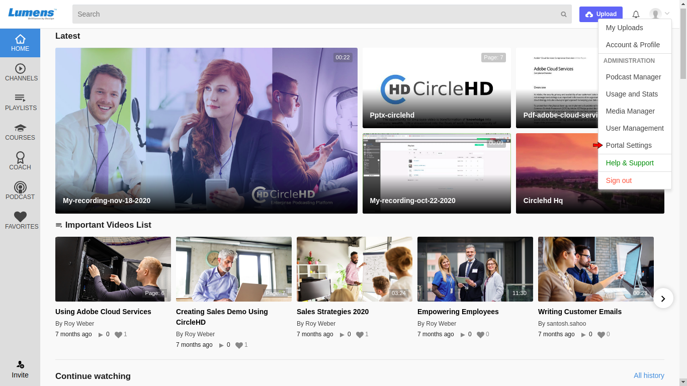
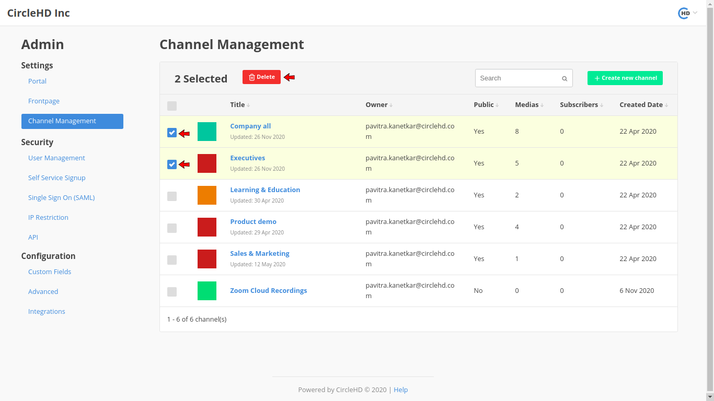
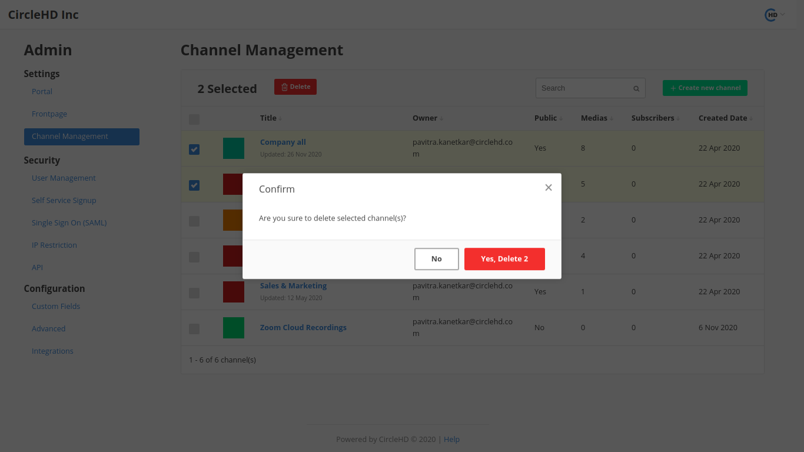

# How To Delete Channel?

**1-** Click on the “**Portal Settings**” icon in the right.

**3-** Click on **Channel Management**

**4-** Select Channel or multiple Channels and click on Delete button.

**4-**  You will be asked to confirm if you want to continue to delete, please click “**Yes**” to continue with deletion.

