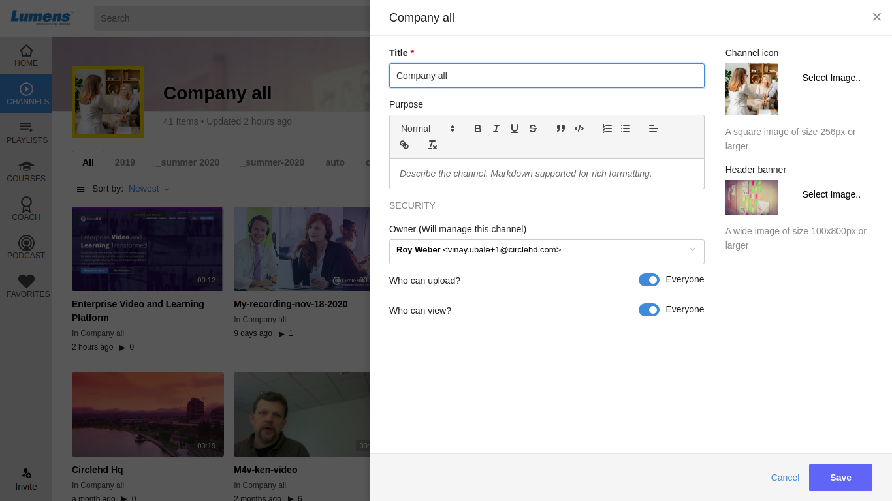

# How To Edit Channel?

**1-** To edit the Channel, click on the “**Edit**” icon in the right.

**2-** The **Edit Channel Form** will be opened as below:

**3-** Apply the required changes on the channel definition, and then click on the "**Save**" button when finish.

