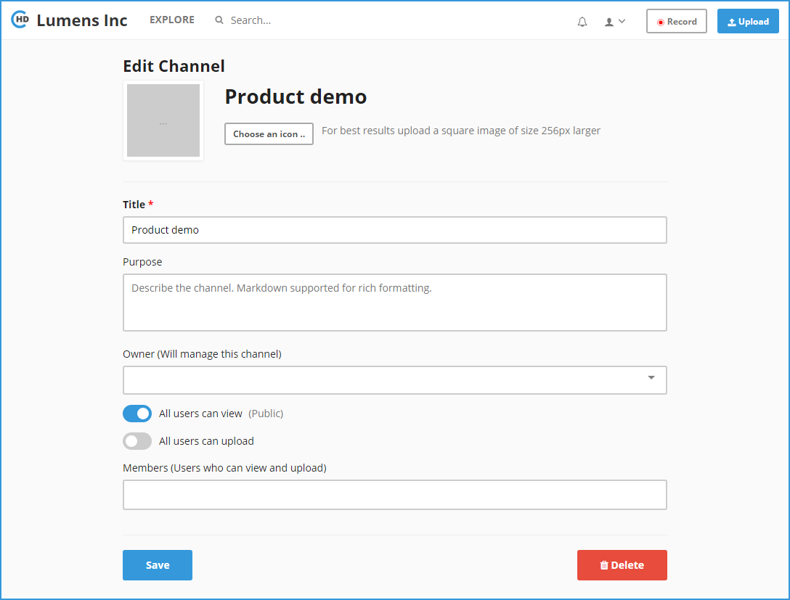

# How To Edit Channel?

**1-** In the left vertical navigation, click on the required Channel directly to load the Channel Page, or click on the “**Explore**” link in the top header, then tap on the channel name. 

**2-** To edit the Channel, click on the “**Edit**” button in the right.

**3-** The **Edit Channel Page** will be opened as below:

**4-** Apply the required changes on the channel definition, and then click on the "**Save**" button when finish.

