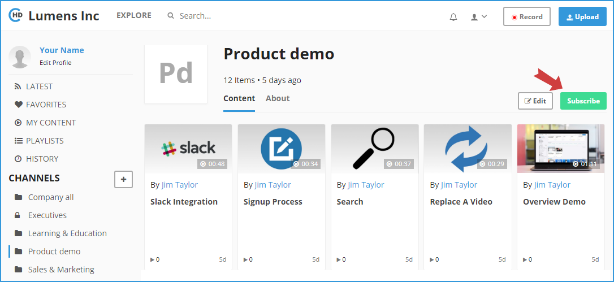
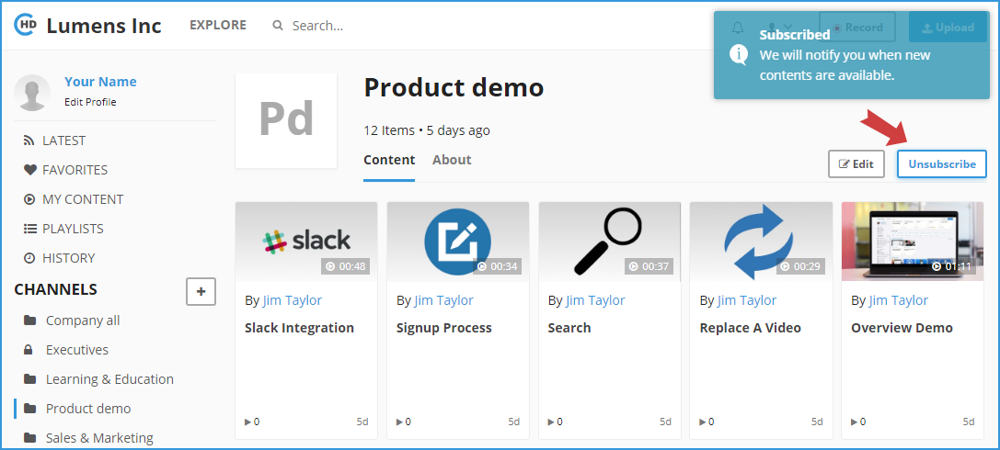

# How To Subscribe/Unsubscribe to a Channel?

**1-** In the left vertical navigation, click on the required Channel directly to load the Channel Page, or click on the “**Explore**” link in the top header, then tap on the channel name. 

**2-** Once you are on the Channel detail page, click on the “**Subscribe**” button in the right. The button text will be “**Unsubscribe**” when open the channels you are already subscribed to them.

**3-** Clicking on “**Subscribe**” button will automatically subscribe you to this channel. The button text will change to “**Unsubscribe**” confirming that you have been successfully subscribed to the channel.

**4-** You can use the same button to “**Unsubscribe**” from a channel. 

**5-** You will receive Channel updates in email by subscribing to it.

