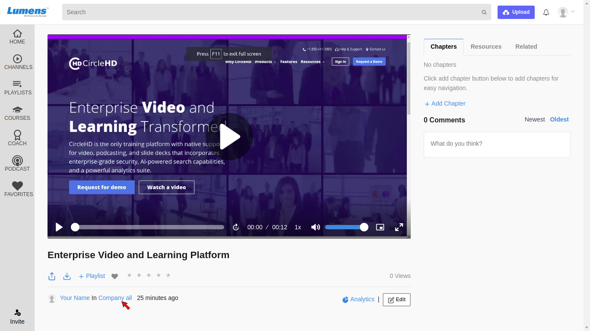
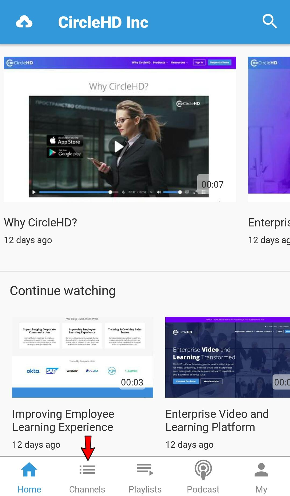
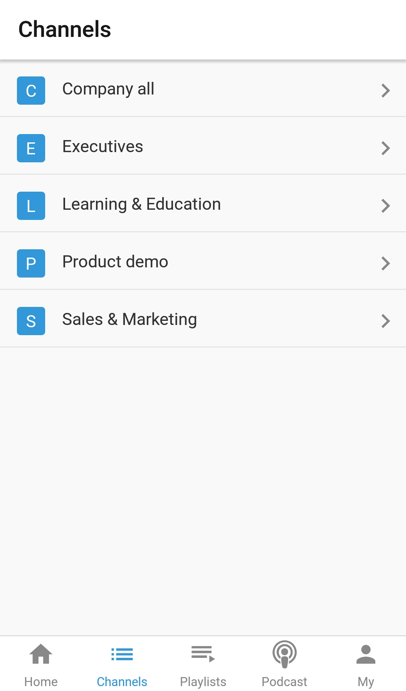
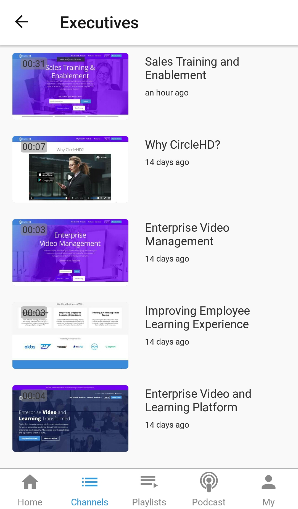

# How to View Channel Content?

You can view only the channels created by you, in addition to those created by other users provided they have given you view access. 

Access to a channel can also be requested to the Channel owner or Portal Admin. The Channel owner or Admin can follow channel edit steps to add you in the upload users list. 

You can view the channels list in **two ways**:

**1-** By viewing the list in the left vertical navigation:

**2-** By clicking on “**Channel Name**” link on the View Video Page:

### Mobile

**1-** Touch on the Channels option at Bottom Horizontal Menu.

**2-** It lists all priviliged channels.

**3-** To see the videos of a channel, user needs to touch the channel to view its content.

