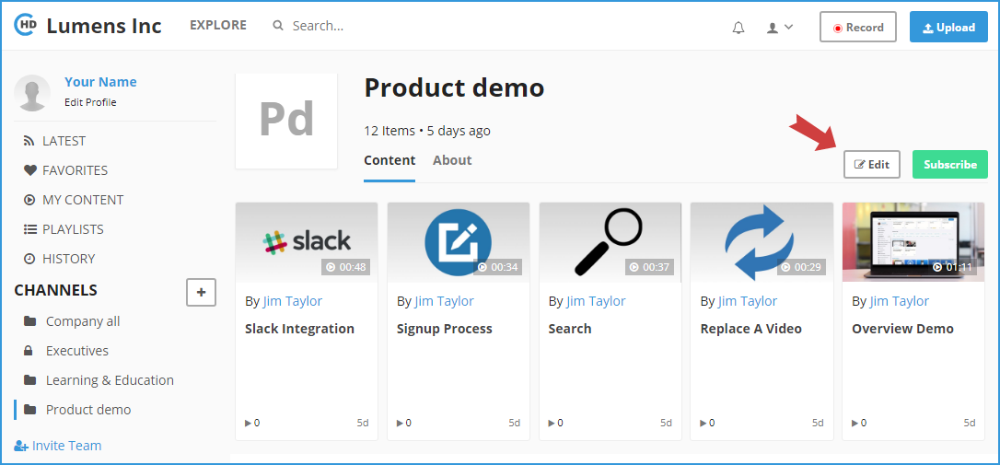
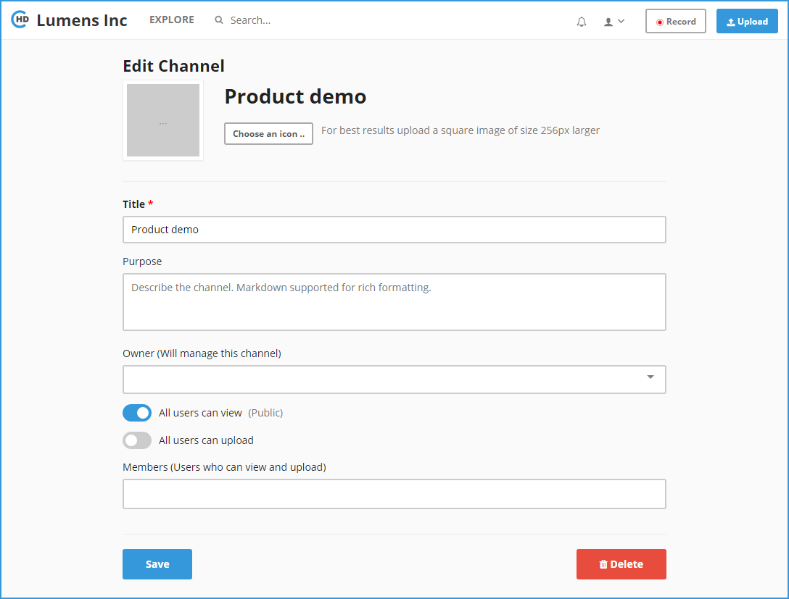

# How to add Co-Owner to Channel?

**1-** Channel creator will also be the Channel Owner, you can add another co-owner by following below steps.

In the left vertical navigation, click on the required Channel directly to load the Channel Page, or click on the “**Explore**” link in the top header, then tap on the channel name. 

**2-** Click on the “**Edit**” button in the right.

**3-** The **Edit Channel Page** will be opened as below:

**4-** Add Co-Owner in the "Owner" box. You can type in the user email or select existing user from the drop down to assign a Co-Owner, and then click on the "**Save**" button when finish.

\*\*\*\*

