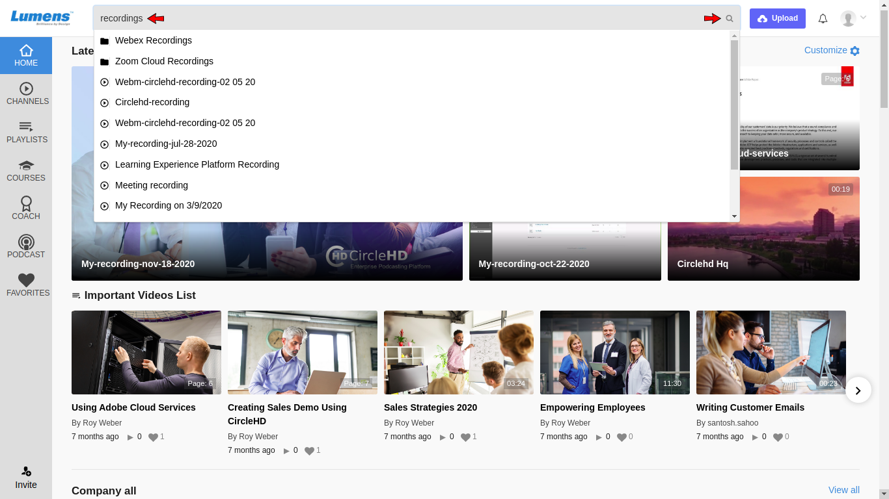
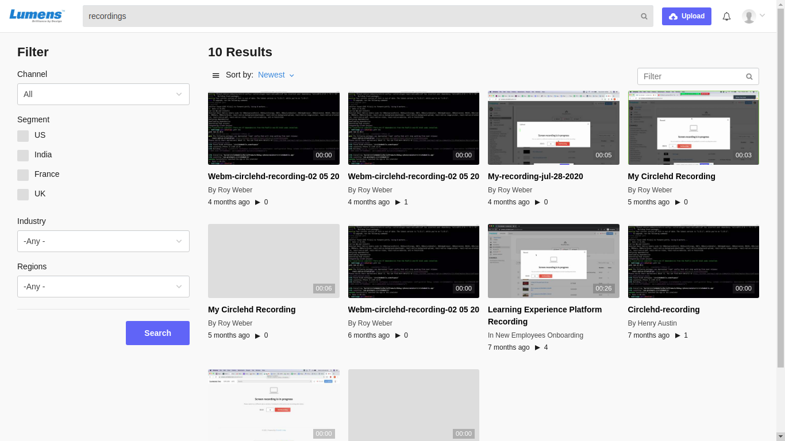
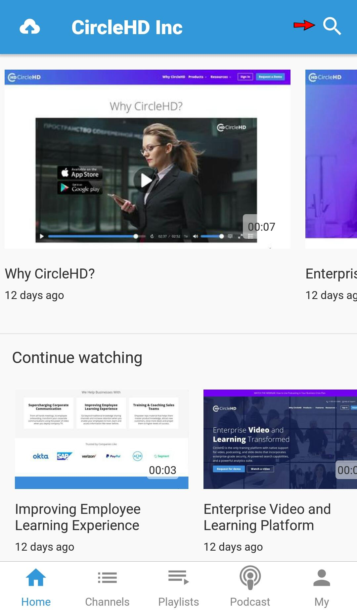

# How To Search All Portal Videos?

Videos can be searched using tags as search keywords. Once you are signed into CircleHD portal, you can enter search keyword in top Search box. You can add more search terms as needed to refine search further on results page.

If you click on search icon without adding any search term, Advanced search options and popular searches will be displayed on the page.

### Mobile

**1**- Touch the search icon to open text box to write a video keyword.

**2**- Write the keyword in the text box and it will list the videos with the matched text.

