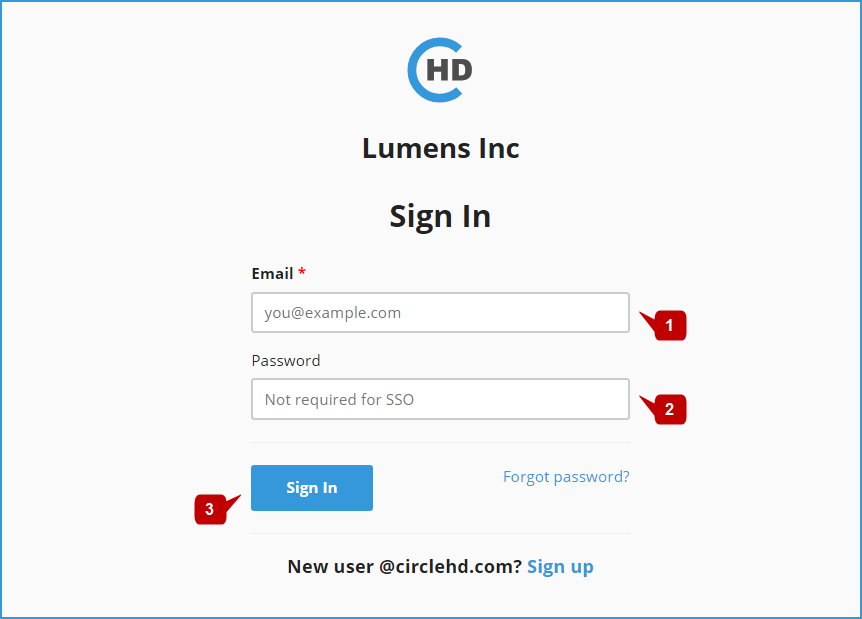
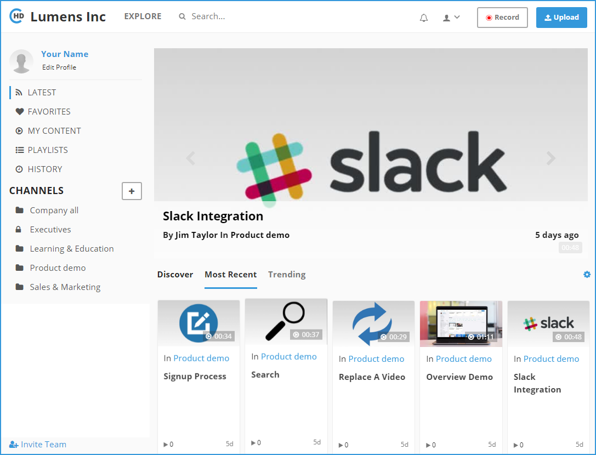

# How to Sign In?

To login to the CircleHD Portal, open your assigned portal URL using your web browser


_**\[http://&lt;EnterpriseName&gt;.circlehd.com\]**_ 


The below login screen will be loaded;

* Enter the Email **\[1\]** and Password **\[2\]** assigned to you, then click on the "Sign In" button **\[3\]**, you will be automatically redirected to your CircleHD dashboard. 
* In case you forget the password, you can click on the "**Forget Password?**" link.

> That in case you are using SSO, you will need to enter login name only.

