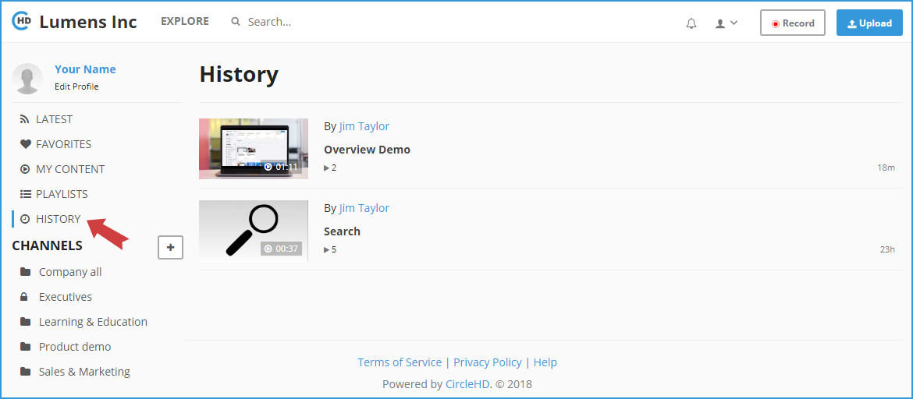

# How to Open My History List?

All visited videos by the user will be automatically added to the user's history list. Videos saved in History Page are personalized and accessible only to the signed in user.

User can open videos history by clicking on the "**History**" icon on the portal FrontPage.

at the right side the last visit time is appeared.

