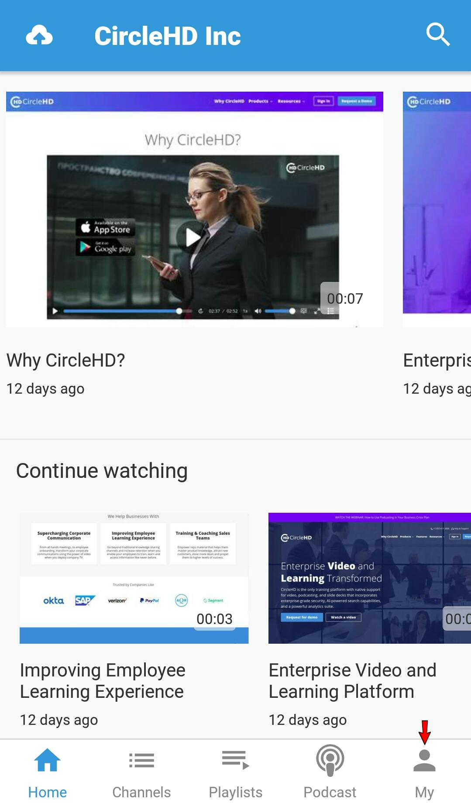
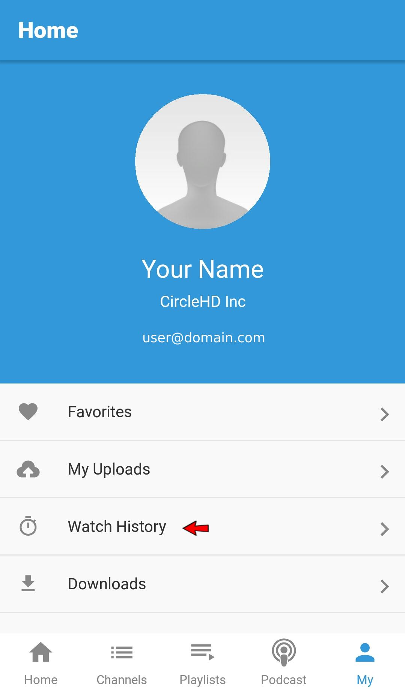

# How to Open My History List?

All visited videos by the user will be automatically added to the user's history list. Videos saved in History Page are personalized and accessible only to the signed in user.

User can open videos history by clicking on the "**Favorites**" option in the Left Menu. Here "**History**" option is available to see the list of videos watched.

at the right side the last visit time is appeared.

### Mobile

1- Touch **My** option ****at the **Bottom Horizontal** menu.

**2-** Touch option **'Watch History'** to open History list.

