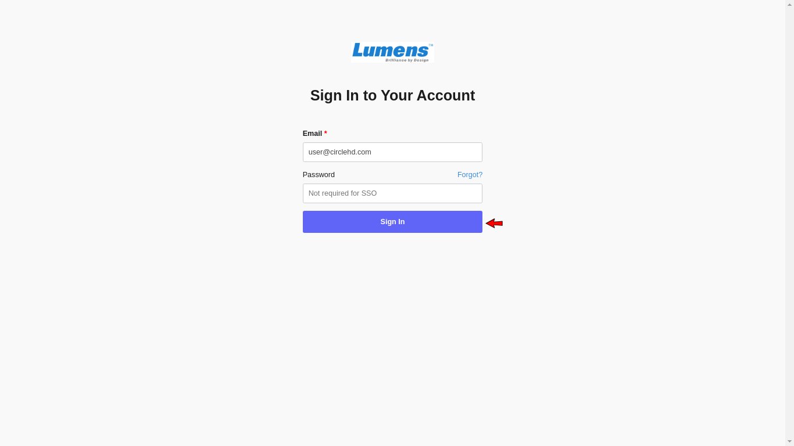
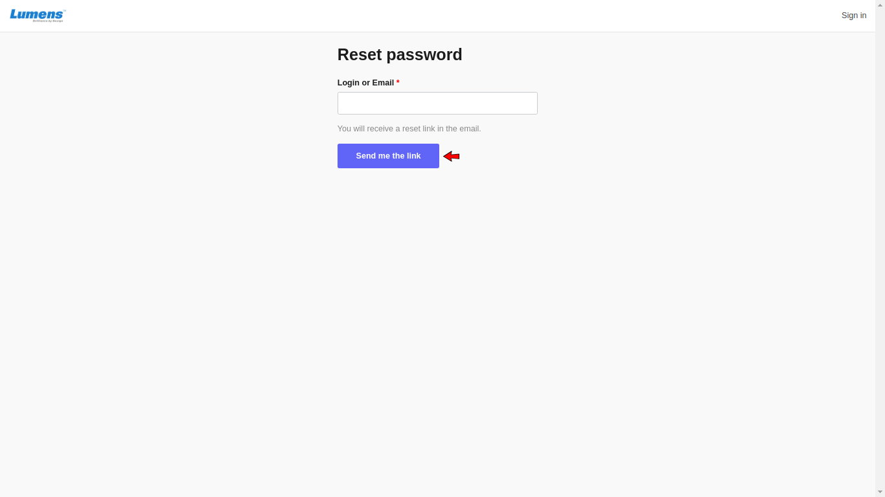
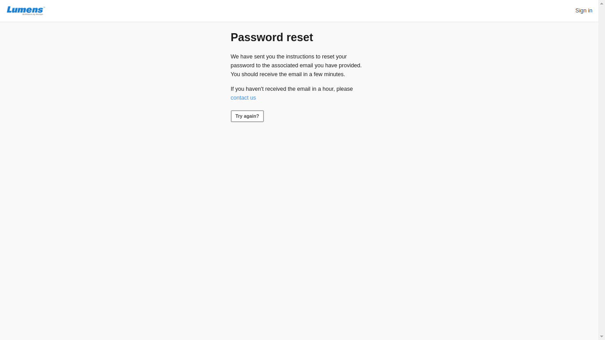
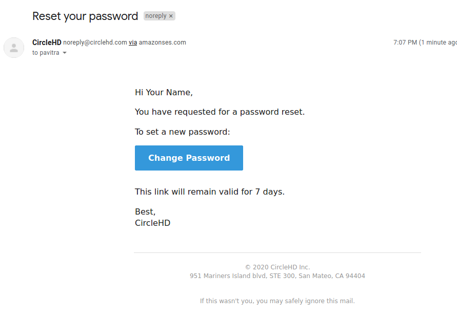

# How to Reset Password?

Follow the below steps to reset your password:

**1-** Open the CircleHD portal, then click on the "**Forgot Password?**” link in the login screen:

**2-** It will take you to the **Reset Password** Page:

**3-** Enter your login user id or email **\[1\]**, and then click on the "Reset" button **\[2\]**. 

**4-** You will receive an **email** with instructions to reset the password.

**5-** Click on the “**Change Password**” link and follow instructions to set a new password.

