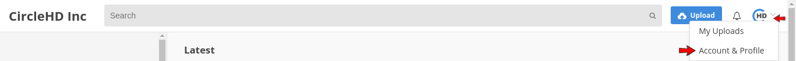
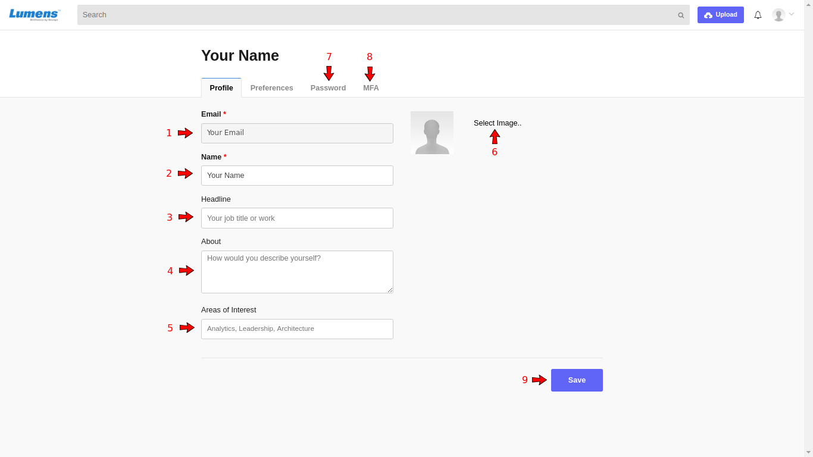
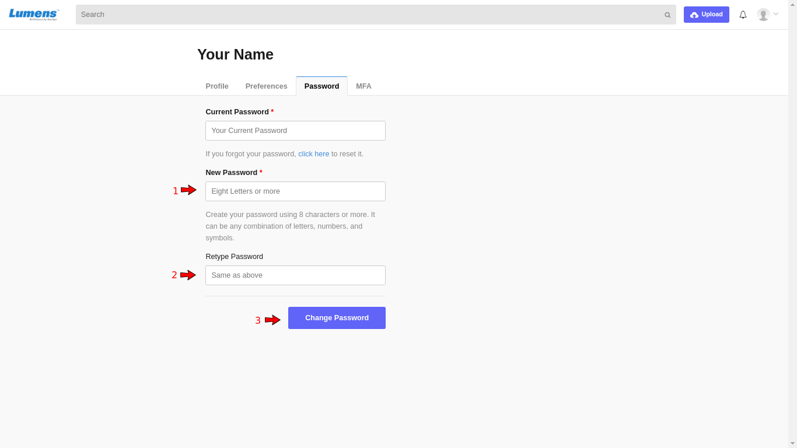
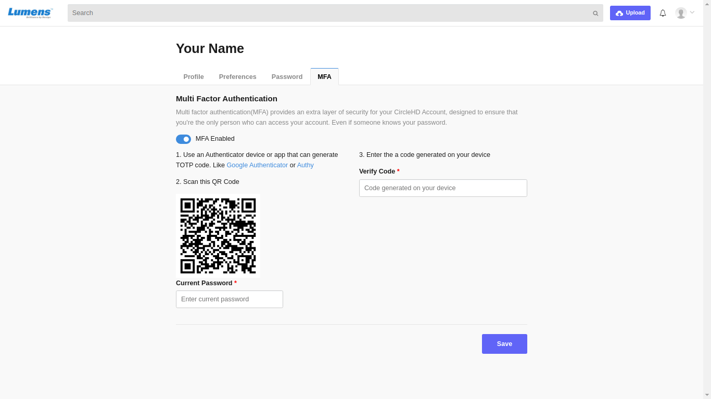

# How to Setup Account & Profile?

To setup your account and profile information, click on **\[Account & Profile\]** option in the drop-down menu.

The below screen will be opened:

**1- Email:** your registered email is displayed here **\[1\]**

**2- Name:** enter your full name **\[2\]**

**3- Headline:** enter your job title and work **\[3\]**

**4- About:** describe yourself in a few words **\[4\]**

**5- Areas of Interest:** specify your area of interest **\[5\]**

**6- Profile Photo:** click on the "**Choose File**" button to select your profile photo **\[6\]**

**7- Change Password:** click on "**Change Password**" link to change your password **\[7\]**

Enter the new password **\[1\]** and retype it for confirmation **\[2\]**, then click on the "**Change**" button **\[3\]** when finish.

**8- Multi-Factor Authentication:** click on this link to define multi-factor authentication **\[8\]**

* Scan the displayed QR Code using Google Authenticator or Authy mobile application. 
* Verify your account by entering the code generated in the app in the "**Verify Code**" field.

**9-** Click on "**Save**" button **\[9\]** when finish to save the profile changes.

