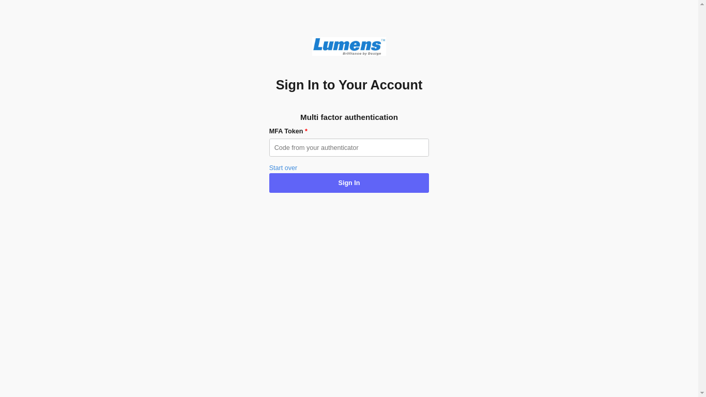
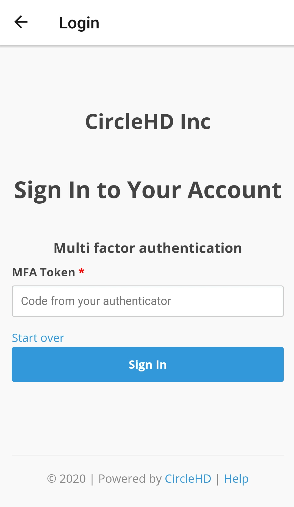

# How to Sign In With MFA Token?

In case the Mutli-Factor Authentication \(MFA\) is enabled in your account, you will be redirected to the below page to enter the **MFA Token**:

Open the authentication application on your mobile and enter the authentication code **\[1\]**, then click on the "**Sign In**" button **\[2\]**.

### Mobile

In case the Mutli-Factor Authentication \(MFA\) is enabled in your account, login page redirects on below pageto enter the **MFA Token** after successful token.

