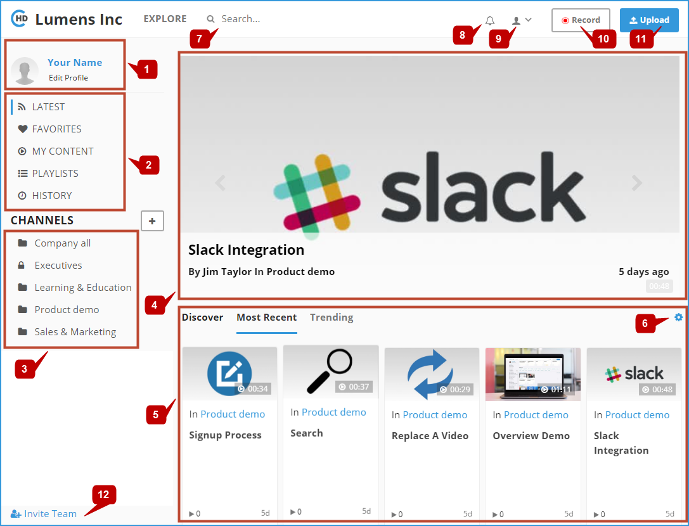

# System FrontPage

After login to the portal, the below **FrontPage** will appear:

Through this screen you can do the following:

1. **Edit Profile:** this is to edit your profile information.
2. **Navigation List:** enables you navigate easily between the main portal pages.
3. **Channels List:** enables you to view and navigate through channels 
4. **Latest uploaded videos:** displays the last 5 recently uploaded public or shared videos 
5. **Videos Navigator:** enables you to be up-to-date with the most recent and trending videos.
6. **Customize FrontPage:** this is to customize the layout of your portal FrontPage.
7. **Explore and Search** – Displays the list of channels and Leaderboard, you can search the portal for some content by entering keywords in search box and hitting enter or clicking search icon
8. **Notifications / Alerts:** This feature is work in progress currently.
9. **Main Menu:** click on this icon and then select the required option from the drop-down menu.
10. **Record:** click on this button to start video recording studio.
11. **Upload:** click on this button to upload a video.
12. **Invite Team:** you can use this option to invite other company employees from your team / company to join your CircleHD portal.

