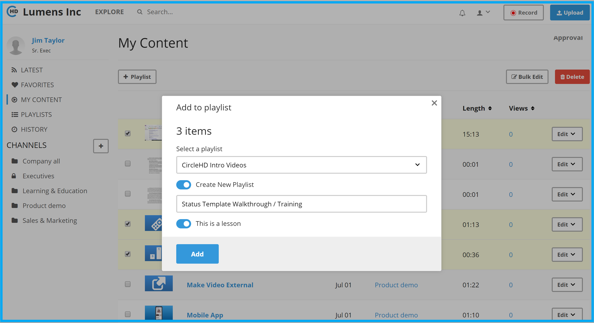
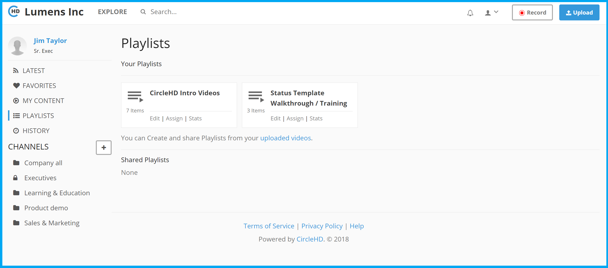

# How to create a new Lesson?

Before we create a new lesson, please make sure you have uploaded all the videos needed for the lesson, but following steps on how to upload videos.

Creating lessons is an extension of creating playlists, you will start with creating a new playlist. 

Below is one way to create a new playlist, Please follow below steps;

1. Once you login to CircleHD portal, click on "My Content" in the left vertical menu. The assumption is that you have already uploaded the videos and ready to create a lesson. 

1. Select the videos that need to be included in the lesson. Click on "+ Playlist" button on top left. This will load the new playlist popup form.

2. Select "Create a New Playlist" option. Enter the Lesson name below and also select "This is a lesson" option. Click "Add" to create the lesson.

3. This will complete lesson creation. You can view all lessons created by clicking on "Playlists" in left vertical Menu. Note that for lessons, you will see "Edit \| Assign \| Stats" if you are the owner for the lesson.

For assigning a lesson, please refer to and for viewing stats please refer to 

