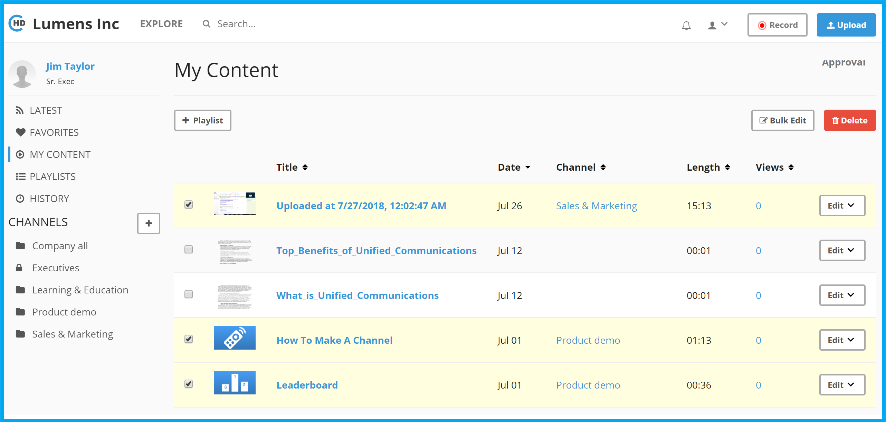

# How to create a new Course?

Before we create a new course, please make sure you have uploaded all the videos needed for the course, but following steps on how to upload videos.

Creating courses is an extension of creating playlists, you will start with creating a new playlist. 

Below is one way to create a new playlist, Please follow below steps;

1. Once you login to CircleHD portal, click on "My Content" in the left vertical menu. The assumption is that you have already uploaded the videos and ready to create a course. 

2. Select the videos that need to be included in the course. Click on "+ Playlist" button on top left. This will load the new playlist popup form.

3. Select "Create a New Playlist" option. Enter the course name below and also select "This is a course" option. Click "Add" to create the course.

4. This will complete course creation. You can view all courses created by clicking on "Playlists" in left vertical Menu. Note that for courses, you will see "Edit \| Assign \| Stats" if you are the owner for the course.

For assigning a course, please refer to [https://help.circlehd.com/lessons/how-to-assign-lesson](https://help.circlehd.com/lessons/how-to-assign-lesson) and for viewing course stats please refer to [https://help.circlehd.com/lessons/how-to-view-lessons-stats](https://help.circlehd.com/lessons/how-to-view-lessons-stats).

For any questions, please email "support@circlehd.com".

