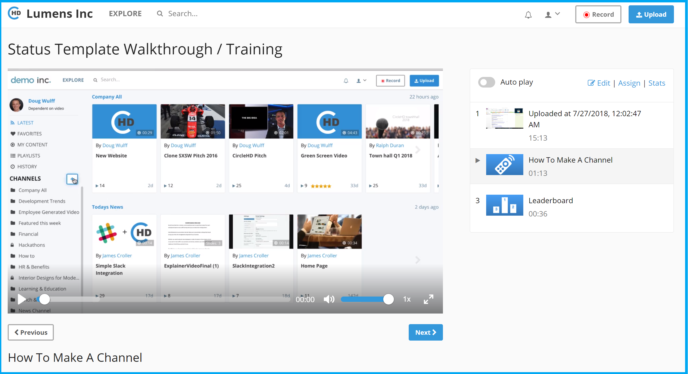

# How to assign a lesson?

To assign a new lesson, please follow below steps.

1. You can Assign lessons in two ways within CircleHD portal. Once the lesson \(playlist\) is created, you can click on "Playlists" option in the left vertical menu to view all playlists including lessons created by you. If you are the owner of any lesson, then it will display "Edit \| Assign \| Stats" option below the playlist.

2. The second way is to click on the lesson / Playlist and go to Lesson detail page, which will also display "Edit \| Assign \| Stats" option in the top right. 

3. Click on "Assign" option below the lesson / playlist you need to assign. 

4. This will load the "Assign" popup form. Enter emails in the box under "Users" label. You can add custom message in the message box if needed. Select the due date below the message box, which will be the deadline to complete the lesson. Click "Assign" once all form is filled.

5. Clicking on Assign will send emails to each user email entered, mentioning the lesson assigned to them with other details. User can start the lesson by clicking on the link provided in email.

6. Once lesson is completed, it will display a completion certificate and also update status for the lesson.

