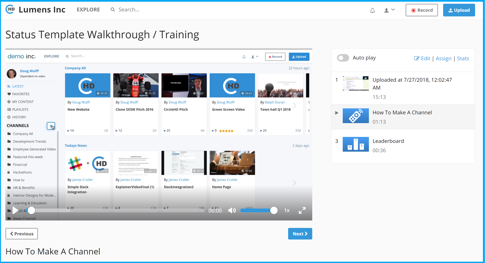

# How to view Stats for Lessons?

You need to be admin or lesson owner to view stats. To view lesson stats, please follow below steps;

1. You can view lessons in two ways within CircleHD portal. Once the lesson \(playlist\) is created, you can click on "Playlists" option in the left vertical menu to view all playlists including lessons created by you. If you are the owner of any lesson, then it will display "Edit \| Assign \| Stats" option below the playlist.

2. The second way is to click on the lesson / Playlist and go to Lesson detail page, which will also display "Edit \| Assign \| Stats" option in the top right. 

3. Click on "Stats" option. This will load the "Stats" page. 

