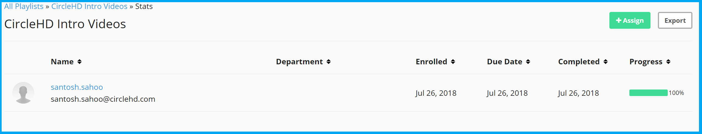

# What are Courses in CircleHD?

Users can create courses in CircleHD using playlists. We like to call playlists as CircleHD's Magic list, which can offer a lot of cool features out of the box, courses being one of them.

CircleHD Courses can be assigned to a single or group of users and their progress can be tracked individually using Courses Stats report. 

This feature allows admins or managers to push compliance or training to their teams or employees and monitor their progress as needed. You can categorize this feature as a microlearning system.

