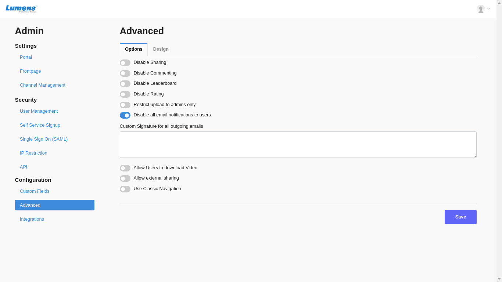

# Advanced

There are settings which can you can enable or disable for all the users of your account. Example : Enable or Disable external sharing of Media\(s\), Enable or Disable adding comments, ratings etc.

Open Portal Settings.

There is **Advanced** option ****available ****in ****the ****left ****menu ****bar**.** Two tabs are available on the Advanced page i.e. **Options** and **Design**

**1- Options**

These options are not user specific. It applies for all the users.

**Disable Sharing :** 

**Disable Commenting** : It prevents to add comments on the view video page.

**Disable Leaderboard** : 

**Disable Rating** : It prevents to add rating for a video.

**Restrict Upload to admins only :** If this option is enabled, regular users cannot upload the video.

**Disable all email notifications to users :** It stops sending notification emails to users.

**Custom Signature for all outgoing emails :** An admin adds a signature for all system emails. A signature can be a company name or admin's contact details.

**Allow users to download videos :** If this option is enabled, a regular user can see download option on view video page to download a video.

**Use classic navigation :** Default navigation menu is advanced. If admin wants to enable classic menu, this option should be enabled. 

**2- Designs**

Here admin can add css code to change the look and feel of the portal. Custom css and custom html can be added here.

\*\*\*\*

