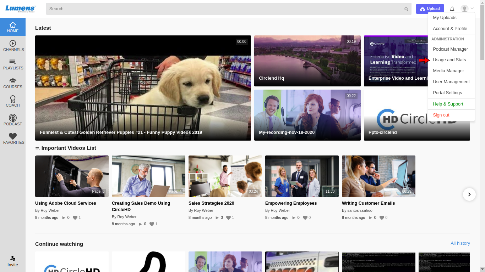

# How to Monitor the Views?

Usage and Statistics are available to Portal Admins only. If you are an Admin, please click on the \[**Usage and Stats**\] option in the drop-down menu.

Click on the "**Views**" tab to open the **Views Page**:

In the Views page you can monitor the portal usage by evaluating the report of users.

The difference between **Media Reports** and **Views Reports** is ****Media Reports displays the result based on the media\(s\) and Views Reports displays the result based on the user\(s\).

