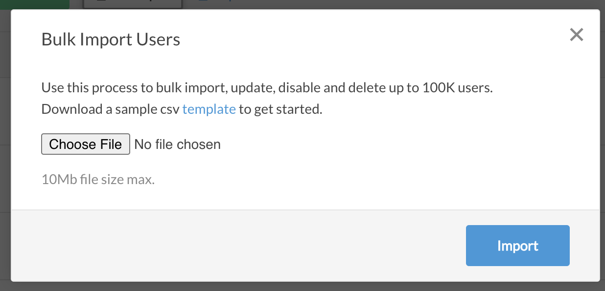

# How to add users in bulk to the Portal?

If an enterprise needs to add hundreds or more users quickly, manually adding them is not a scalable option. To make this easier for enterprises, CircleHD portal allows adding users in bulk using a CSV file format. This can be done by Admins only. 

 1. Go to top right, Admin options. Click on User Management. On User Management screen, click on Bulk Users link.

2. You can click on the "template" link to download the csv format. Once downloaded, create a list of all users in this csv format, by exporting users from your existing employee management system.

3. Please refer to table below to understand options in the CSV file.

<table>
  <thead>
    <tr>
      <th style="text-align:left">Field</th>
      <th style="text-align:left">Values</th>
      <th style="text-align:left">Comments</th>
    </tr>
  </thead>
  <tbody>
    <tr>
      <td style="text-align:left">email</td>
      <td style="text-align:left">users email</td>
      <td style="text-align:left"></td>
    </tr>
    <tr>
      <td style="text-align:left">status</td>
      <td style="text-align:left">
        
enable - to enable a disabled user

        
delete - to delete an existing user

        
disable - to disable / deactivate existing user

      </td>
      <td style="text-align:left"></td>
    </tr>
    <tr>
      <td style="text-align:left">fname</td>
      <td style="text-align:left">First name</td>
      <td style="text-align:left">SSO Attribute</td>
    </tr>
    <tr>
      <td style="text-align:left">lname</td>
      <td style="text-align:left">Last name</td>
      <td style="text-align:left">SSO Attribute</td>
    </tr>
    <tr>
      <td style="text-align:left">display_name</td>
      <td style="text-align:left">display name</td>
      <td style="text-align:left">SSO Attribute</td>
    </tr>
    <tr>
      <td style="text-align:left">department</td>
      <td style="text-align:left">department name</td>
      <td style="text-align:left">SSO Attribute</td>
    </tr>
    <tr>
      <td style="text-align:left">function_name</td>
      <td style="text-align:left"></td>
      <td style="text-align:left">SSO Attribute</td>
    </tr>
    <tr>
      <td style="text-align:left">manager</td>
      <td style="text-align:left">manager email</td>
      <td style="text-align:left">SSO Attribute</td>
    </tr>
    <tr>
      <td style="text-align:left">ou</td>
      <td style="text-align:left">organizational units</td>
      <td style="text-align:left">SSO Attribute</td>
    </tr>
    <tr>
      <td style="text-align:left">job_title</td>
      <td style="text-align:left">role</td>
      <td style="text-align:left">SSO Attribute</td>
    </tr>
    <tr>
      <td style="text-align:left">location</td>
      <td style="text-align:left">location of employee</td>
      <td style="text-align:left">SSO Attribute</td>
    </tr>
    <tr>
      <td style="text-align:left">cost_center</td>
      <td style="text-align:left">cost center for employee</td>
      <td style="text-align:left">SSO Attribute</td>
    </tr>
  </tbody>
</table>

4. Once CSV file is ready, click on "Choose File" to select the updated user csv file that you created in Step 2 and click on Import.

5. All users and updates should be complete once its processed the csv file.

