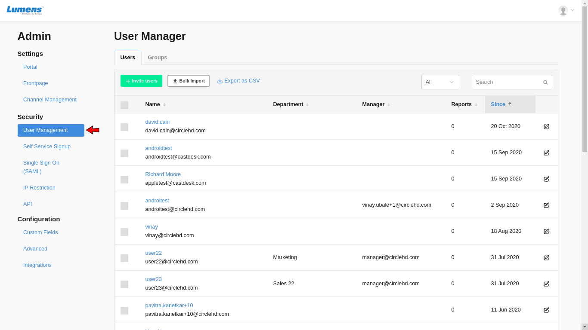

# How to create Groups?

**1-** Click on the Portal Settings on the top right menu.

**2-** To open **User Manager,** click on the **User Management** in the left side bar.

**3-** Click on **Groups** to open Groups tab.

**4-** Click on **Create New Group** to create new group.

**5- Create New Group** form will be opened.

Here user needs to add Group name and email id of users to form a group.

