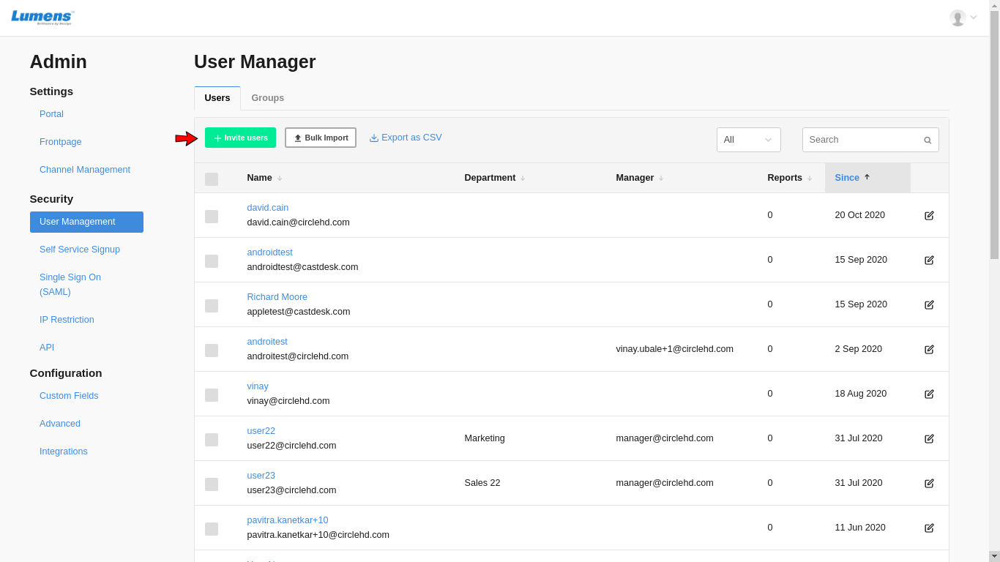
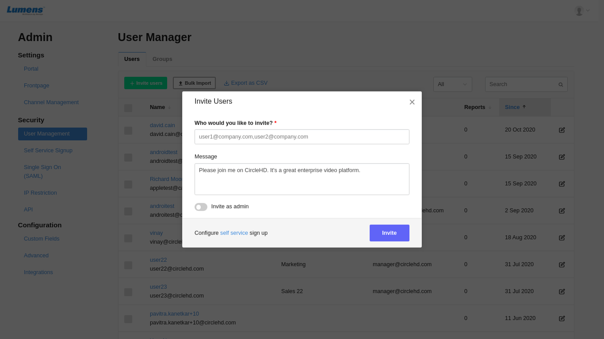

# How to Invite Users to The Portal?

Only system administrators can invite new users or manage portal users. Note that the access to the “**Portal Settings**” on the Portal Settings page is restricted to the system administrators only. Please follow below steps to add / invite users: 

**1-** Once you are logged into CircleHD portal, in the top right header, there will be a user icon and a drop down arrow next to it. Click on the icon or drop down arrow to load the user options. Depending on the type of user access, you may see limited options in the drop down.

**2-** Click on “**User Management**” option in the top right drop down list under “**Administration**” section, this will load your user management page as shown below.

**3-** On User Management page, Click on “**Invite Users**” button in the top left. This will load the Invite users popup box.

**4-** You can also open invite users popup screen directly by clicking on the "**Invite**" link as below:

**5-** Enter the email for the user. If the user needs to be added as admin, please enable the "**Invite as admin**" option. 

**6-** Click on the "**Invite**" button once you enter all the details. This will send an email invite to the user to join the portal. 

