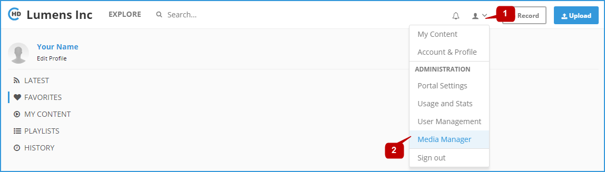
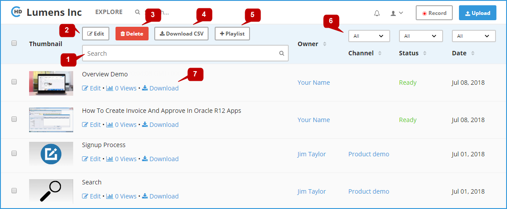
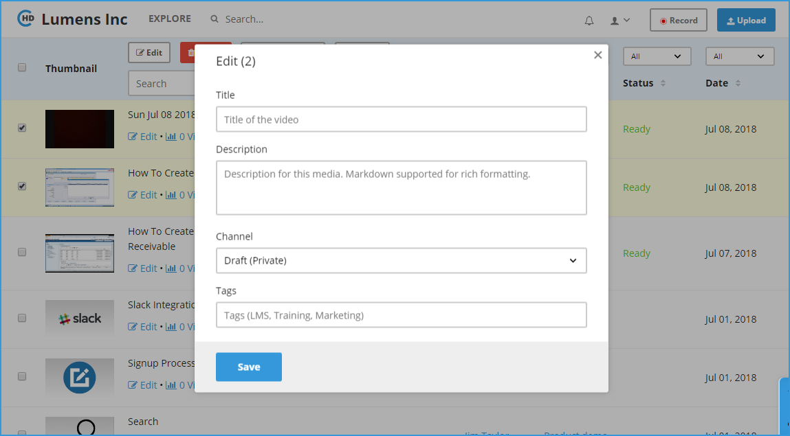
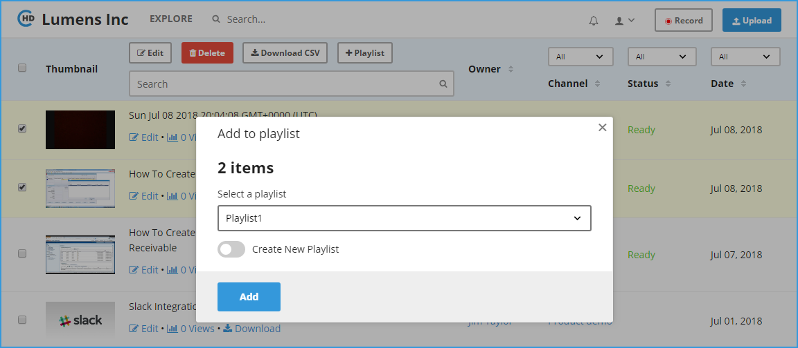

# How to Manage Portal Media?

You can manage portal media files easily by editing, downloading, deleting, adding to a playlist, and check the total views. 

To open media manager page, click on the \[**Media Manager**\] option in the drop-down menu.

The below media manager page will be opened:

In the media list you can see for each file the file name, owner, channel, status, and upload/create date. 

**1-** Use the search text box **\[1\]** to search and filter the media files list 

**2-** Select one or more media files from the list, then click on the "**Edit**" button **\[2\]** to edit all selected media files

**3-** Select one or more media files from the list, then click on the "**Delete**" button **\[3\]** to delete all selected media files. 

**4-** Select one or more media files from the list, then click on the "**Download as CSV**" button **\[4\]** to download the media files information as CSV file. 

**5-** Select one or more media files from the list, then click on the "**+ Playlist**" button **\[5\]** to add the selected media files to a specific playlist or create a new playlist for them.

**6-** Use the list filters **\[6\]** to filter the media files list by Channel, Status, and Date columns. 

**7-** Use these buttons **\[7\]** to edit the media file, open the views analytics report, or download it.

