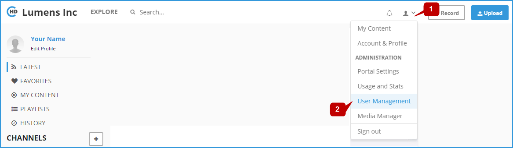
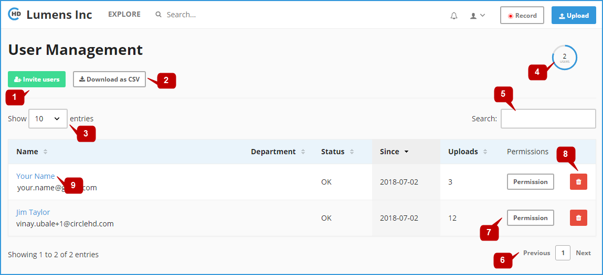
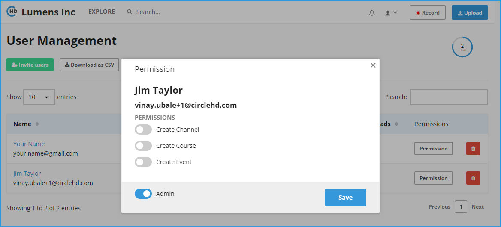
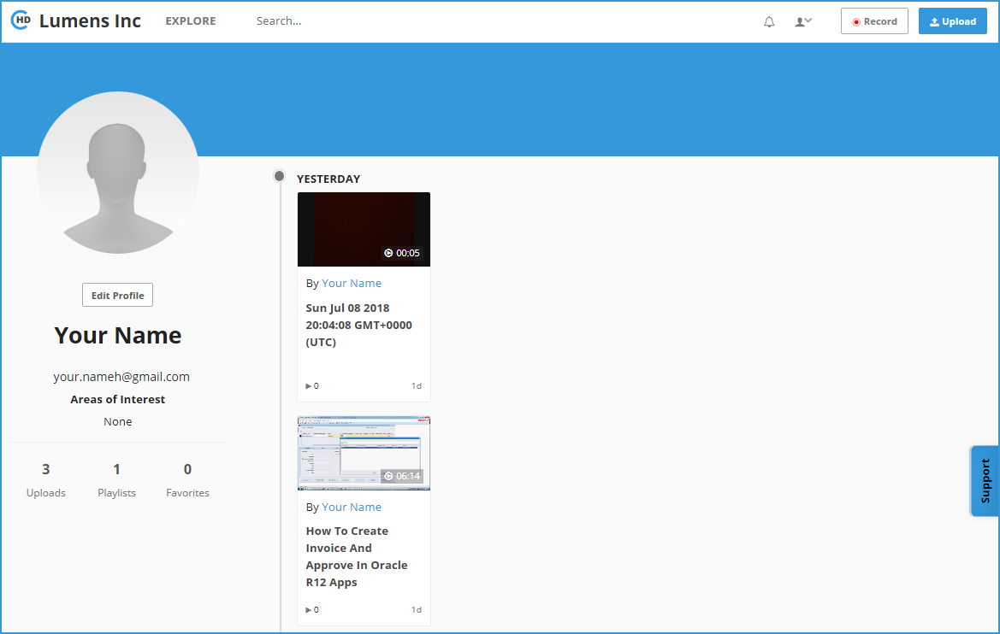

# How to Manage Portal Users?

You can manage portal users easily by inviting new users, assign the proper permissions, or delete their accounts permanently. 

To open user management page, click on the \[User Management\] option in the drop-down menu.

The below user management page will be opened:

In the users list you can see for each user the username, email address, department, status, signup date, and total uploaded videos. 

**1-** To invite new users to your portal, click on the "**Invite Users**" button **\[1\]** 

**2-** To download the users information as CSV file, click on the "**Download as CSV**" button **\[2\]** 

**3-** Change the value in the text box **\[3\]** to control how many users are listed per page. 

**4-** Total count of the portal users are displayed here **\[4\]** 

**5-** Use the search text box **\[5\]** to search and filter the users list 

**6-** Click on "**Previous**" and "**Next**" buttons **\[6\]** to navigate through the users list pages 

**7-** Click on the "**Permissions**" button **\[7\]** to define the user's permissions:

* **Create Channel:** to enable the user define new channels in the portal. 
* **Create Course:** to enable the user define new courses in the portal. 
* **Create Event:** to enable the user define new events in the portal. 
* **Admin:** define the user as system administrator

**8-** Click on the "**Delete**" button **\[8\]** to delete the user's account. 

**9-** Click on the "**username**" link **\[9\]** to open the user profile page:

