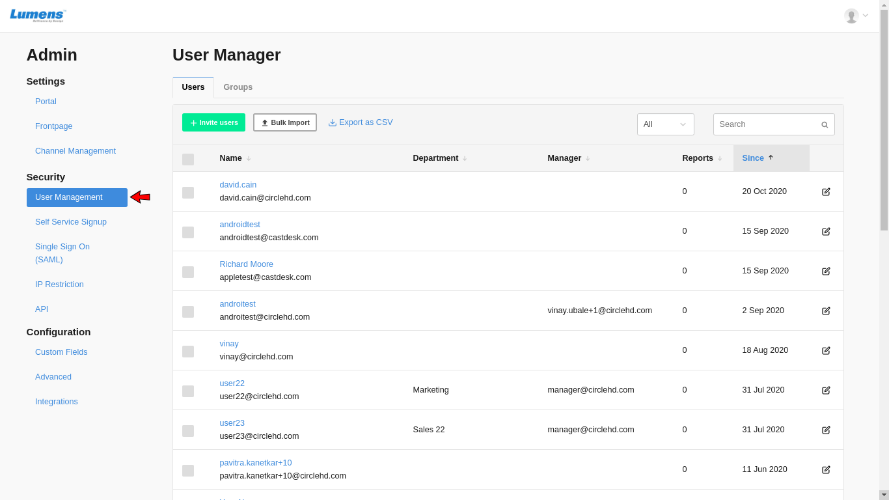
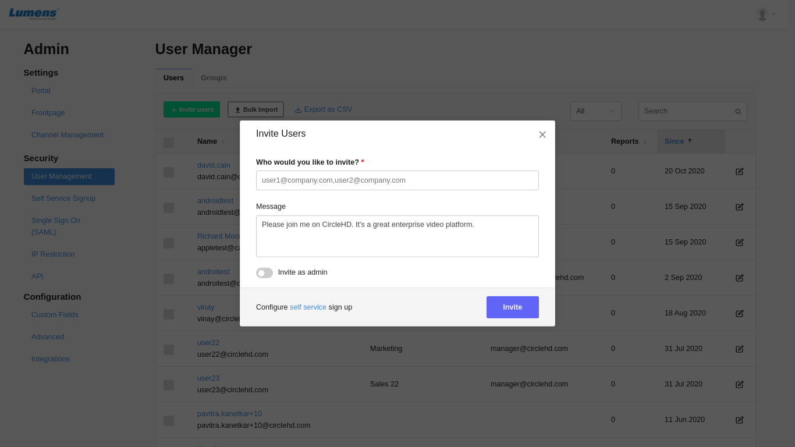
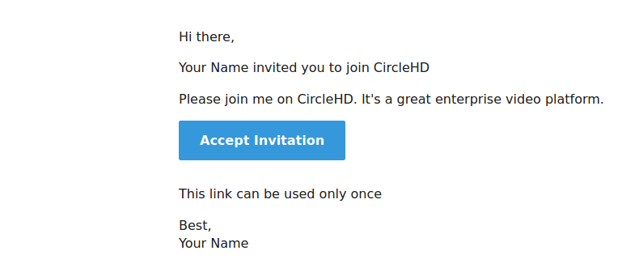
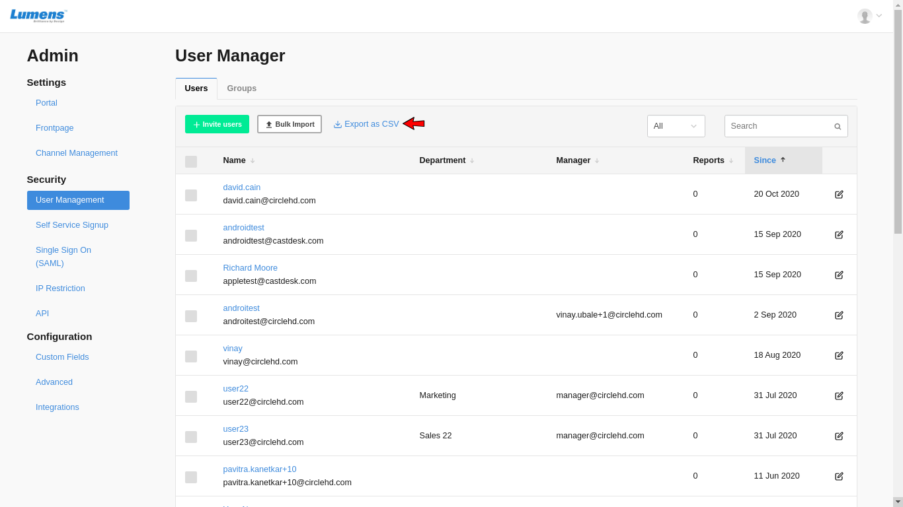
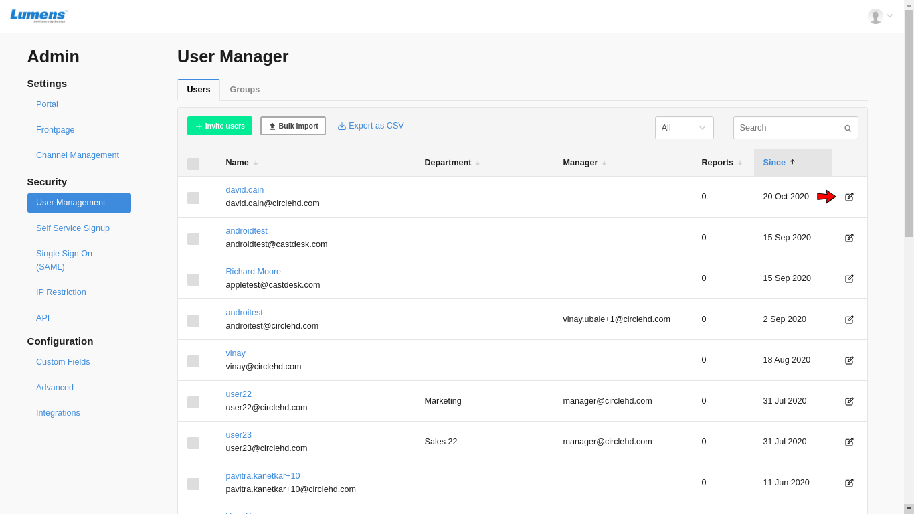
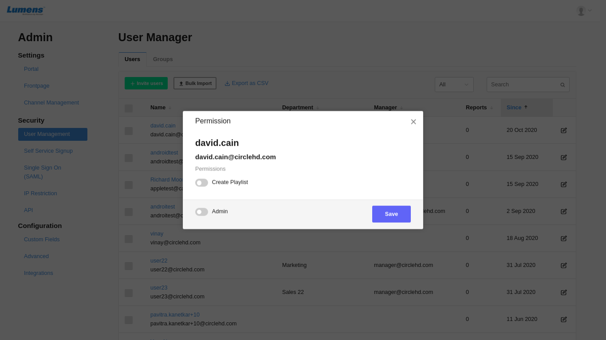
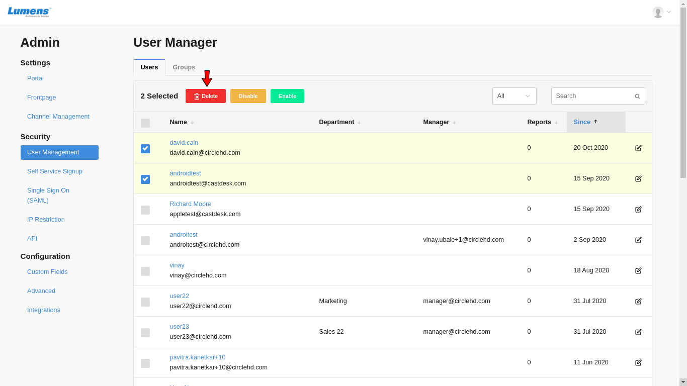
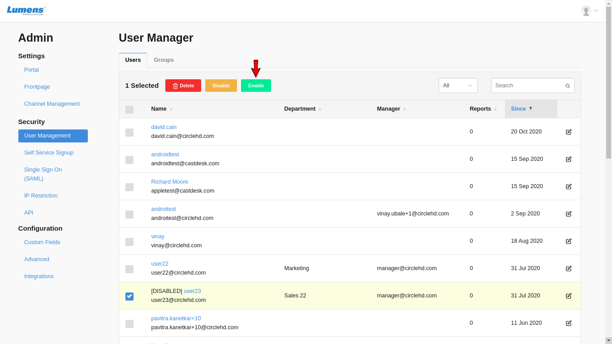
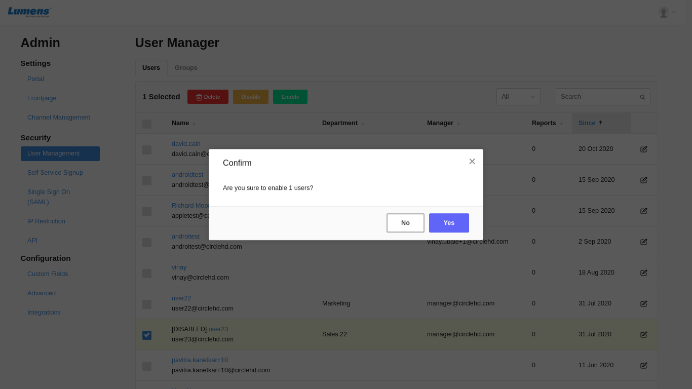
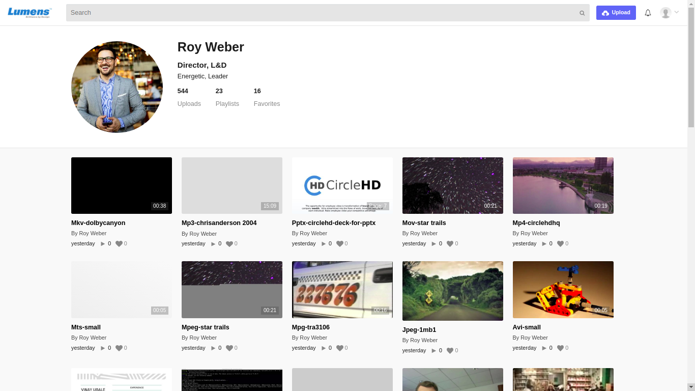

# How to Manage Portal Users?

**1-** Click on the Portal Settings on the top right menu.

**2-** To open **User Manager,** click on the **User Management** in the left side bar.

Here you can manage portal users easily by inviting new users, assign the proper permissions, or delete their accounts permanently. 

**3-** Click on the **Invite Users** button to invite more users.

It opens invite users form where admin can invite users to join portal.

**Field 'who would you like to invite'** - Here admin can invite one user or multiple users.

**Message** - Admin adds a message which is sent with the email to the users.

**Invite as admin** - Admin can invite users as a regular user or admin.

**4-** Once admin clicks on Invite button, an email is sent to the users with the message.

Accepting the invitation takes user on 'set password' page. Once user sets the password, an account is created and user can always log into the account using these credentials.

Registered users are listed on the User Management Page.

**5- Export as CSV** option is available to export all the users in a csv file.

**6-** Admin can filter users by their status i.e. Active, Disabled, Admin & Manager or search users by their email or name.

**7-** Admin can edit the "**Permissions**" of the users using edit button.

**8a-** Select one user or multiple users and click on the "**Delete**" button to delete the user's account. This action cannot be reverted.

**8b-** If you want to restrict login access of a user and you do not want to delete the user, you can select one user or multiple users and simply disable them.

**8c-** Disabled user\(s\) can be re-enabled by using Enable option.

**9-** If you want to see profile of a user, click on the "**username**" link **** to open the user profile page.

