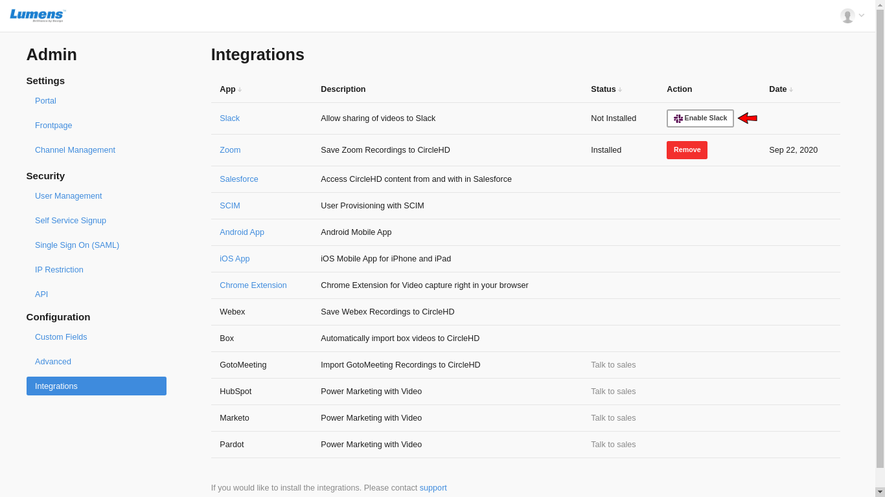
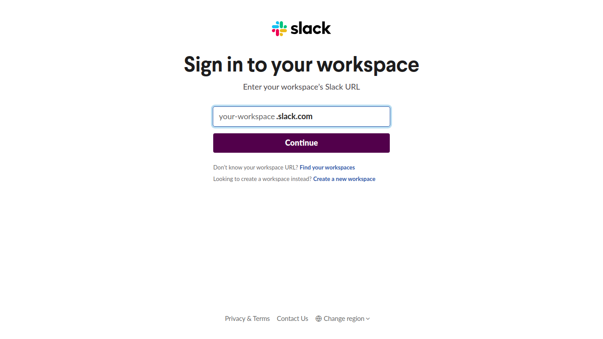

# Slack Integration

**Slack Integration** can be achieved on the Portal Settings page within CircleHD Portal. Note that “**Portal Settings**” access is restricted to Admins only, and they can view or edit them as needed. If you are an Admin, please follow below steps to edit portal settings. Open Portal Settings.

On the Portal Settings page, click “**Enable Slack**” .

This will load the Slack integration page.

On Slack Integration page, in the top right, you can sign into your workspace. Once you are signed in, click on the “**Post to**” drop down in the center content, and click “Authorize”. This will complete the slack integration with CircleHD Portal.

