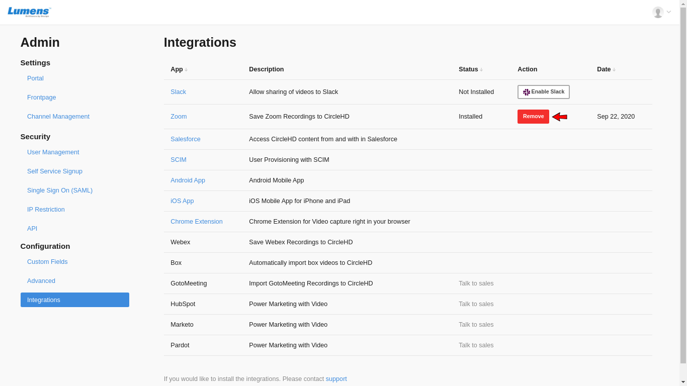

# Uninstall Steps - Zoom Integration

If you have Admin access on CircleHD portal and Zoom app is installed, please follow below steps for uninstalling the Zoom integration app.

1. Once signed in CircleHD portal as an Admin, click on top right Profile drop down, and select "Portal Settings"

2. Click on "Integrations" in the left navigation, to load all integration options. 

3. Click on "Remove" button next to Zoom, it will prompt you to confirm. Click "Yes", this will remove the zoom integration from your CircleHD portal.

