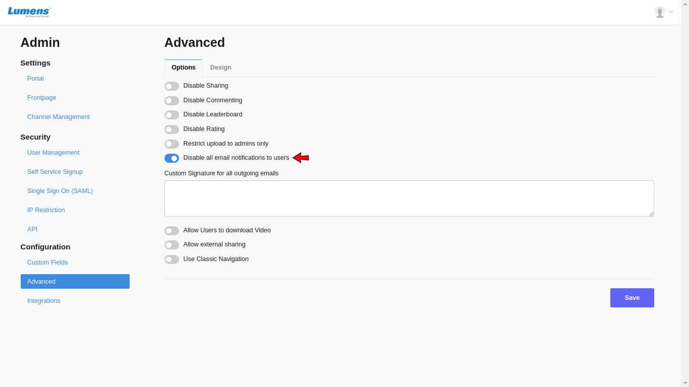

# Enable / Disable Email Notifications

Notifications can be enabled or disabled at Admin level, by going to clicking on top right drop down, Portal Settings =&gt; Advanced =&gt; Disable email notifications

If toggle button is ON, it means notification emails are disabled.

Default is enabled for users.

