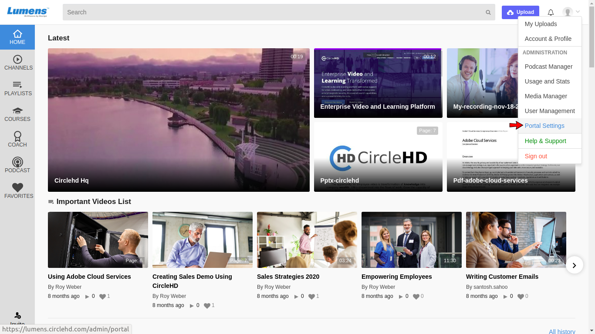

# SETTINGS

Portal Settings displays the global configuration for your Enterprise’s CircleHD portal. Note that “**Portal Settings**” access is restricted to the system administrators, and they can view or edit them as needed. If you are an Admin, please click on \[**Portal Settings**\] option in the drop-down menu.

