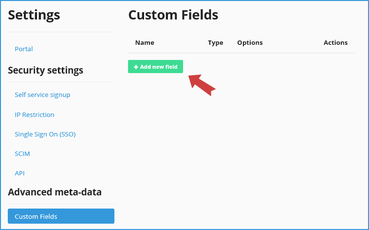
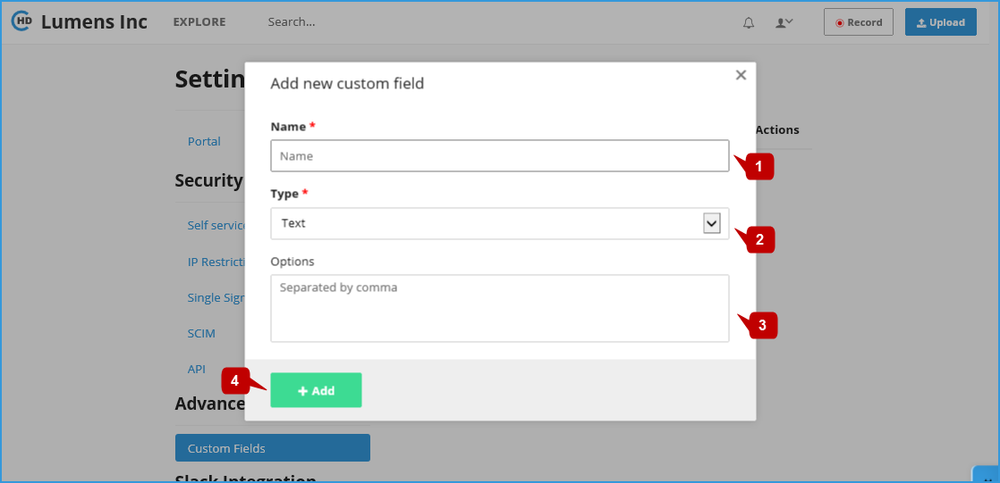
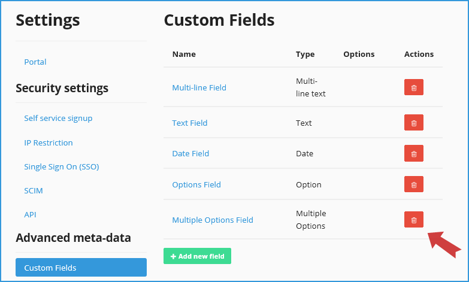

# Advanced Meta-Data

Enterprises can define Custom Fields as metadata against each uploaded Video in their respective CircleHD Portal. The custom fields can also be used while searching for Videos within the portal. Every time a user uploads a new video, or edits an existing video, the custom fields will be displayed in the edit Video page allowing them to update as needed. 

Only Admins can create Custom Fields using the Portal settings page.

## Add / Delete Custom Fields

**1-** Click on “**Add New Field**” button to add a new custom field. This will load a popup form to create a new custom field.

**2-** You can add the Custom Field name **\[1\]**, select “Type” **\[2\]** from drop down and add “Options” **\[3\]** if the field is a multiple selection type. Click on “Add” **\[4\]** once details are entered in the popup page. If you need to cancel this action, you can do so by clicking on “x” on the top right of the popup form. 

**3-** For deleting an existing Custom Field, you can click delete icon on the right next to the custom field that you need to delete.

