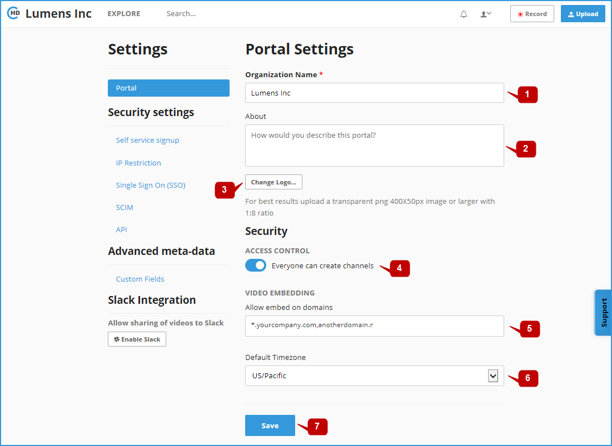

# Portal Settings

On the **Portal Settings** section, you can define the below:

**1-** Enter your **Organization Name \[1\]** 

**2- Describe** your portal in a few words **\[2\]** 

**3-** Set the portal **Logo** **\[3\]**, for best results upload a transparent png 400X50px image or larger with 1:8 ratio 

**4-** Define the **Access Control** \(Everyone can create channels\) **\[4\]** 

**5-** Define the **Video Embedding URL** **\[5\]** 

**6-** Select the **Default Timezone** for the portal **\[6\]** 

**7-** Click on the "**Save**" button **\[7\]** when finish

