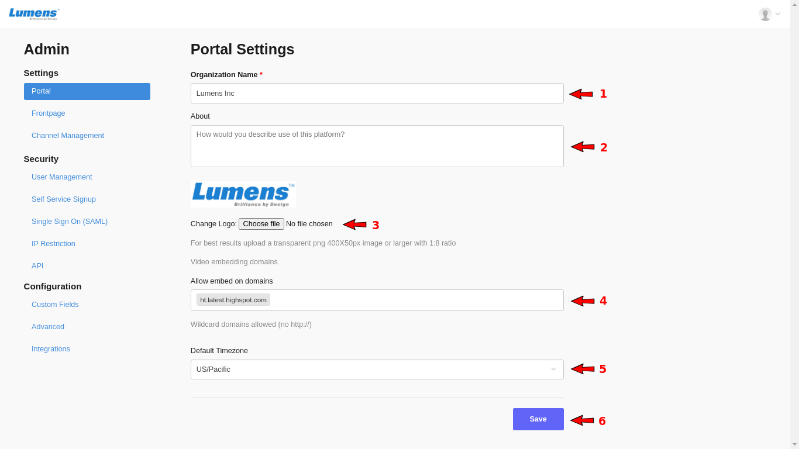

# Portal Settings

On the **Portal Settings** section, you can define the below:

**1-** Enter your **Organization Name \[1\]** 

**2- Describe** your portal in a few words **\[2\]** 

**3-** Set the portal **Logo** **\[3\]**, for best results upload a transparent png 400X50px image or larger with 1:8 ratio 

**4-** **Video Embedding Whitelisting of Domains \[4\]** 

By default users must be logged in to watch on the embed. If you have a trusted site, and you don't like to force the users to log-in before watching, you can enable trusted site under portal settings.

Users accessing iframe based embedding from these domains will not be prompted to login. However, the username will not show up in analytics if they have not previously logged into CircleHD

**5-** Select the **Default Timezone** for the portal **\[5\]** 

**6-** Click on the "**Save**" button **\[6\]** when finish

