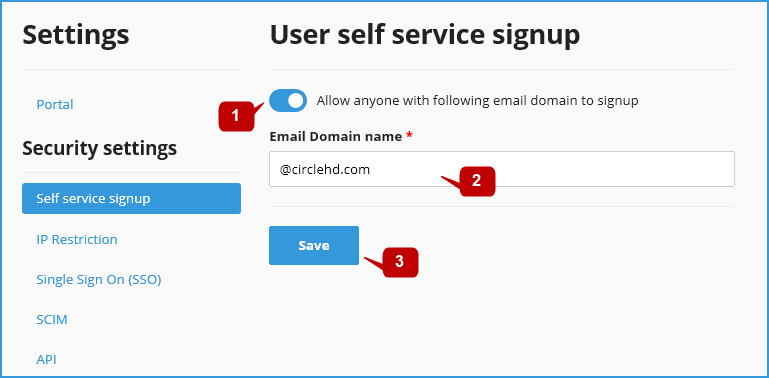
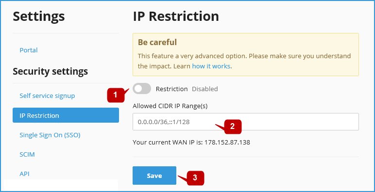
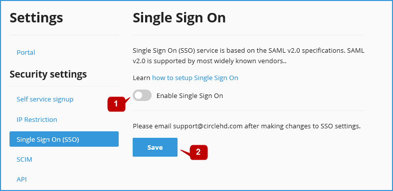
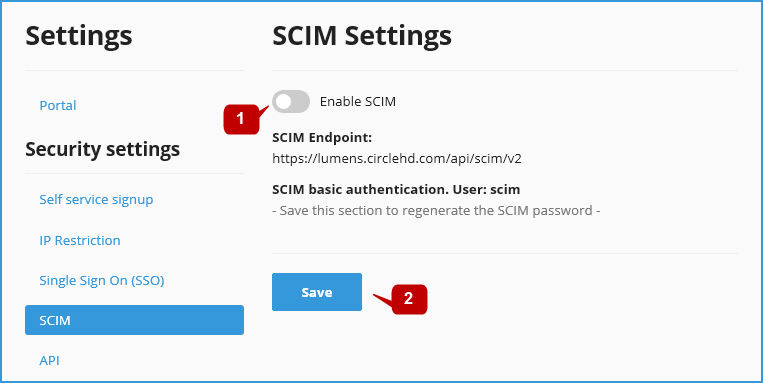
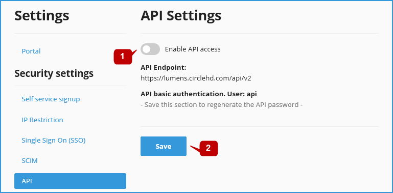

# Security Settings

On the **Security Settings** section, you can define the below: 

## User Self Service Signup 

Self Service Signup applies to SSO integration only. When a user is signed into CircleHD portal using his work email domain, he can be automatically added as a user to CircleHD Portal. This feature adds only view access to all videos, they can be provided additional access by Admins or Channel owners. This is part of the Portal Setting, its access is restricted to Admins only. If you are an Admin, you can follow below steps to enable Self Service Signup.

Click on “**Allow Anyone…**” access option, and enter the email domain below. Click “**Save**”.

## IP Restriction

You can whitelist IP address\(es\) and restrict CircleHD Portal access to limited IP addresses. This is part of the Portal Settings, and its access is restricted to Admins only. If you are an Admin, you can follow below steps to whitelabel IP address\(es\).

Click on “**Restriction**” option to enable IP Whitelist. Input the allowed IP ranges or addresses and click “**Save**”.

## Single Sign On \(SSO\) 

SSO Single sign-on allows you to login using your Organization credentials. CircleHD single sign-on \(SSO\) is based on SAML 2.0. CircleHD acts as the Service Provider \(SP\), and offers automatic user provisioning. You do not need to register explicitly to be a user on CircleHD Portal. Once CircleHD receives a SAML response from the Identity Provider \(IdP\), it checks if this user exists. If the user does not exist, CircleHD creates a user account automatically with the received name ID provided this is enabled in Portal Security Settings. CircleHD can also work with other Service Providers such as PingOne, Okta, Centrify, Shibboleth, Gluu, OneLogin, Fugen and Symplified and ADFS 2.0 SAML implementation.

Please refer to the [Steps to Integrate SSO with CircleHD](https://help.circlehd.com/~/edit/drafts/-LIgm7oCpNa-gvx2b6Lm/management/settings/steps-to-integrate-sso-with-circlehd) page for more details.

## SCIM Settings

## API Settings

CircleHD exposes secured REST APIs that can be used by any Enterprise to integrate with their internal systems. These API are secured and need basic authentication to access.

**1-** Click “**Enable API Access**” and click “**Save**” to generate API password. 

**2-** The password will be generate and displayed on the same page, please share the API endpoint, user and password securely to your integration team. 

**3-** To regenerate API key, save the API settings again. 

**4-** NOTE: there can be only one active API key at any given point/

