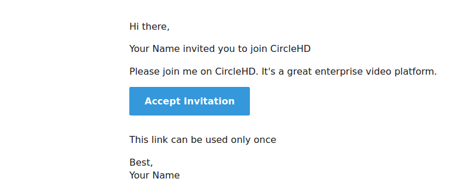
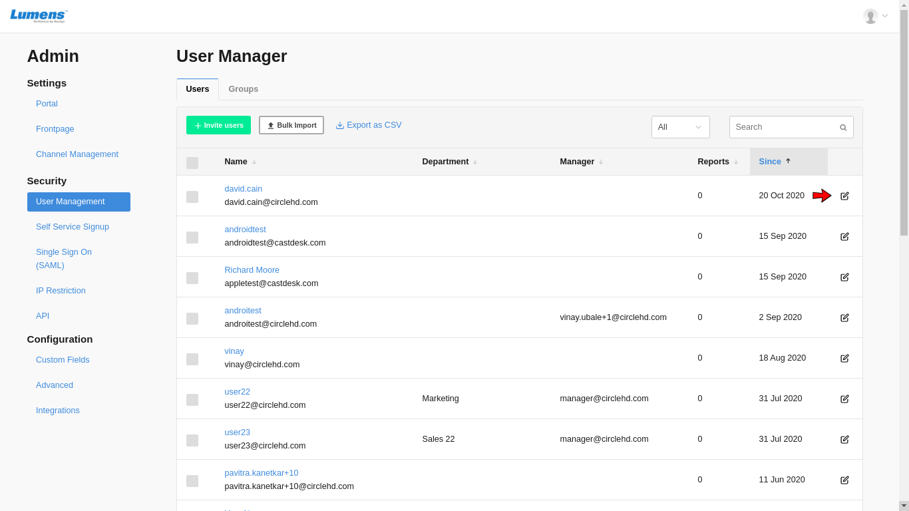
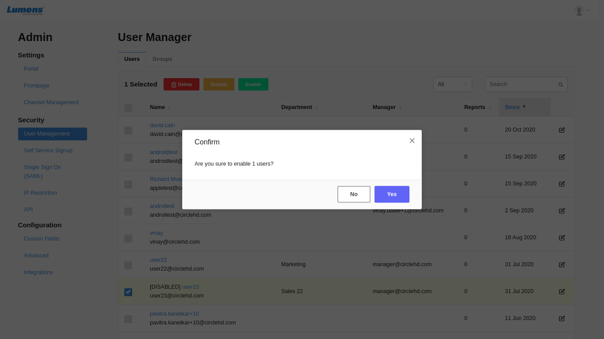

# Security Settings

On the **Security Settings** section, you can define the below: 

## User Management

Click on the **Invite Users** button to invite more users.

It opens invite users form where admin can invite users to join portal.

**Field 'who would you like to invite'** - Here admin can invite one user or multiple users.

**Message** - Admin adds a message which is sent with the email to the users.

**Invite as admin** - Admin can invite users as a regular user or admin.

Once admin clicks on Invite button, an email is sent to the users with the message.

Accepting the invitation takes user on 'set password' page. Once user sets the password, an account is created and user can always log into the account using these credentials.

Registered users are listed on the User Management Page.

**Export as CSV** option is available to export all the users in a csv file.

Admin can filter users by their status i.e. Active, Disabled, Admin & Manager or search users by their email or name.

Admin can edit the "**Permissions**" of the users using edit button.

Select one user or multiple users and click on the "**Delete**" button to delete the user's account. This action cannot be reverted.

If you want to restrict login access of a user and you do not want to delete the user, you can select one user or multiple users and simply disable them.

Disabled user\(s\) can be re-enabled by using Enable option.

If you want to see profile of a user, click on the "**username**" link **** to open the user profile page.

## User Self Service Signup 

Self Service Signup applies to SSO integration only. When a user is signed into CircleHD portal using his work email domain, he can be automatically added as a user to CircleHD Portal. This feature adds only view access to all videos, they can be provided additional access by Admins or Channel owners. This is part of the Portal Setting, its access is restricted to Admins only. If you are an Admin, you can follow below steps to enable Self Service Signup.

Click on “**Allow Anyone with following email domain to signup**” access option, and enter the email domain below. Click “**Save**”.

**Enable Google Authentication** - If google authentication option is enabled, default login page does not appear. If user is not logged in already, it takes user on google login page and user can log into the application by google login only.

## Single Sign On \(SAML\) 

SSO Single sign-on allows you to login using your Organization credentials. CircleHD single sign-on \(SSO\) is based on SAML 2.0. CircleHD acts as the Service Provider \(SP\), and offers automatic user provisioning. You do not need to register explicitly to be a user on CircleHD Portal. Once CircleHD receives a SAML response from the Identity Provider \(IdP\), it checks if this user exists. If the user does not exist, CircleHD creates a user account automatically with the received name ID provided this is enabled in Portal Security Settings. CircleHD can also work with other Service Providers such as PingOne, Okta, Centrify, Shibboleth, Gluu, OneLogin, Fugen and Symplified and ADFS 2.0 SAML implementation.

Please refer to the [Steps to Integrate SSO with CircleHD](https://help.circlehd.com/management/settings/steps-to-integrate-sso-with-circlehd) page for more details.

## IP Restriction

You can whitelist IP address\(es\) and restrict CircleHD Portal access to limited IP addresses. This is part of the Portal Settings, and its access is restricted to Admins only. If you are an Admin, you can follow below steps to whitelabel IP address\(es\).

Click on “**Restriction**” option to enable IP Whitelist. Input the allowed IP ranges or addresses and click “**Save**”.

## API Settings

CircleHD exposes secured REST APIs that can be used by any Enterprise to integrate with their internal systems. These API are secured and need basic authentication to access.

**1-** Click “**Enable API Access**” and click “**Save**” to generate API password. 

**2-** The password will be generate and displayed on the same page, please share the API endpoint, user and password securely to your integration team. 

**3-** To regenerate API key, save the API settings again. 

**4-** NOTE: there can be only one active API key at any given point/

