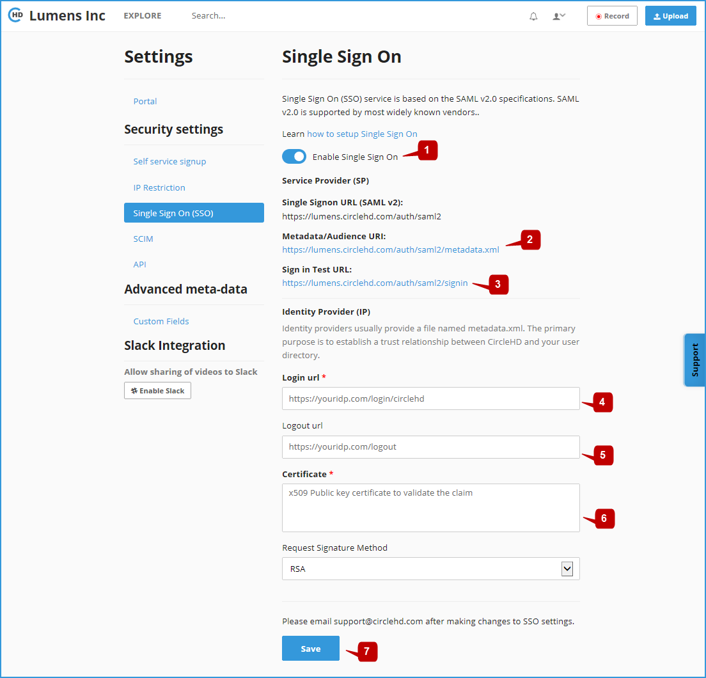

# Steps to Integrate SSO with CircleHD

**1-** First, login to your CircleHD portal with your admin credentials, and navigate to Portal Settings -&gt; Single Sign On \(SSO\), which should be at https://.circlehd.com/admin/sso 

**2-** Turn On Enable Single Sign On Switch **\[1\]**.

**3-** Provide the Metadata/Audience XML **\[2\]** \(https://.circlehd.com/auth/saml2/metadata.xml\) to your IT SSO Admin. The document contains information about Audience system that allows your instance to verify that it is the intended recipient of a SAML response and generate corresponding certificate to be used by CircleHD. 

**4-** Additionally, your Organization IT SSO Admin may ask for the following information and / or configurations,

| 1 | App name | CircleHD |
| :--- | :--- | :--- |
| 2 | App logo | DOWNLOAD FROM HTTPS://STATIC.CIRCLEHD.COM/PUBLIC/STATIC/IMG/CIRCLEHD-LOGO.ZIP |
| 3 | Single sign on URL | https://&lt;YOUR DOMAIN&gt;.circlehd.com/auth/saml2 |
| 4 | Use this for Recipient URL and Destination URL | Yes |
| 5 | Audience URI \(SP Entity ID\) | https://&lt;YOUR DOMAIN&gt;.circlehd.com/ |
| 6 | Default RelayState | Empty |
| 7 | Name ID format | EmailAddress |
| 8 | Application Username | Email |
| 9 | Response | Signed |
| 10 | Assertion Signature | Signed |
| 11 | Signature Algorithm | RSA-SHA256 |
| 12 | Digest Algorithm | SHA256 |
| 13 | Assertion Encryption | Unencrypted |
| 14 | Optional SAML Attributes \(used for reporting\)  | fname: _"&lt;FIRST NAME&gt;"_lname: _"&lt;LAST NAME&gt;"_display\_name: _"&lt;DISPLAY NAME&gt;"_department: _"&lt;ORG/DEPARTMENT&gt;"_function\_name: _"&lt;JOB FUNCTION&gt;"_manager: _"&lt;MANAGER EMAIL&gt;"_cost\_center: _"&lt;COST CENTER&gt;"_rtd\_chain: _"&lt;REPORTING CHAIN \(separated by comma\)&gt;"_location: _"&lt;LOCATION&gt;"_ |

**5-** Receive the following information from your IT SSO Admin to continue. This may be contained in the Identity Provider metadata XML File

* **Login URL \[4\]** \(Identity Provider Single Sign-On URL\) :  TO BE USED FOR REDIRECTING USER WHEN AUTHENTICATION IS REQUIRED.
* **Logout URL \[5\]:** \(OPTIONAL\) THE DESTINATION FOR THE USER WHEN LOGGING OUT FROM CIRCLEHD.
* **Certificate \[6\]:** X509 PUBLIC KEY CERTIFICATE TO VALIDATE THE RESPONSE FROM YOUR IDP. 
* Fill in all the Fields accordingly.

**6-** Click on the "**Save**" button **\[7\]** to save SSO Settings.

## Test the Integration

**1-** Navigate to on the Sign in Test URL **\[3\]**: https://.circlehd.com/auth/saml2/signin

**2-** Make sure you are able to login to CircleHD domain using your Org SSO Credentials.

**3-** Test this integration from a different browser or Incognito mode.

**4-** Make sure new users can log-in from the test URL without having to be invited first.

**5-** If any of the test fail, you can try again by repeating above steps. If issue persists, please reach out to CircleHD Support at support@circlehd.com.

## Activate SSO Throughout The Site

When above Steps and Tests are successful, you have dual authentication mode turned on. Your users will automatically be provisioned when logging in via SSO. However when they access URL directly they will be prompted to enter password.

To activate SSO throughout the site: Please Contact CircleHD support at support@circlehd.com

## Help & Support

If you need help anytime during the process you can send a request via [https://www.circlehd.com/contactus/](https://www.circlehd.com/contactus/) or contact CircleHD support at support@circlehd.com

