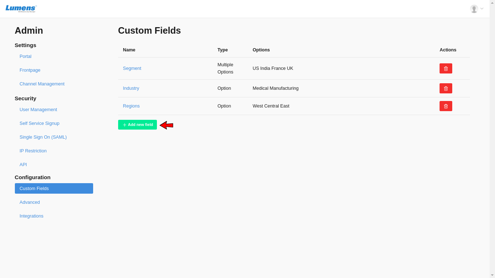
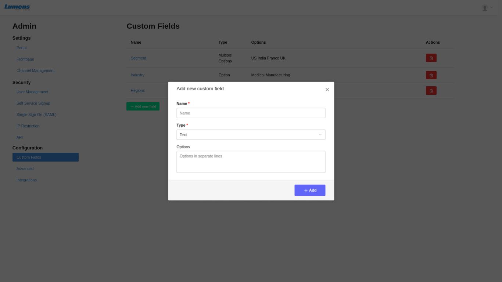

# How to use Full Text Search and custom fields for Content Discovery

CircleHD provides a smart search option to navigate to required content quickly and easily among hundreds or thousands of videos and slides. It uses full text indexing within the actual content and also associated tags, metadata, custom fields. ****

### **What is Full Text Search?**

When the total number of media to search is potentially large, full text search allows users to narrow down the results to the most relevant content. 

During Indexing, we make sure to ignore irrelevant stop words \(e.g. "the", “is”, etc. \) which are not meaningful in searching. CircleHD also implements language-specific stemming on the indexed words. For example, the words "fly", "flying", and "flew" will be recorded in the index under "fly", therefore you can focus on content that is more meaningful to you when you most need them.

In advanced search, if a content piece is a binary file, such as Videos, Audios, Slides, etc. It will gather all words within the binary file and add them as the indexes. 

CircleHD also allows user to add custom fields to be associated with each uploaded and created content, whose value can be indexed to support enhanced filtering of content. 

Custom Fields also makes it easier for admins to create AI filters and reports which can be used to further enhance the user experience and user flow within the portal.

### **How to define Custom fields and use them for smart search?**

Creating custom fields in CircleHD is an admin only option, it allows them to create new fields and types that can be associated with all content pieces within the portal. Currently, this is assigned global to all content pieces within the portal. So whenever an end user edits content within the portal, he will have the option of setting a value for the custom fields.  
  
**Steps to create a new custom field.**

1. Click on the top right Profile menu drop down. Select Portal Settings

2. Click on Configuration =&gt; Custom Fields in the left menu

3. Click on “Add New Field” button, you will see a popup to enter custom field values. 

4. Enter the Name of the custom field, select type and enter values in the text box below if its an option type or a multiple option type.

5. If custom field values are set for a content piece, then CircleHDs smart search will index those values and you would be able to use this to narrow down or filter results further.

