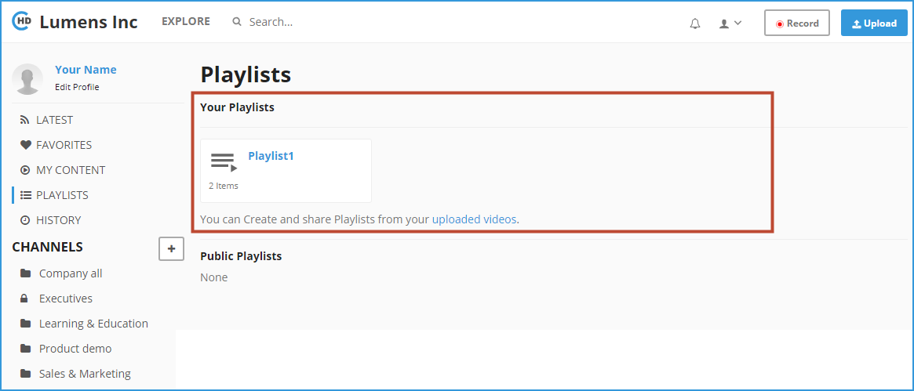
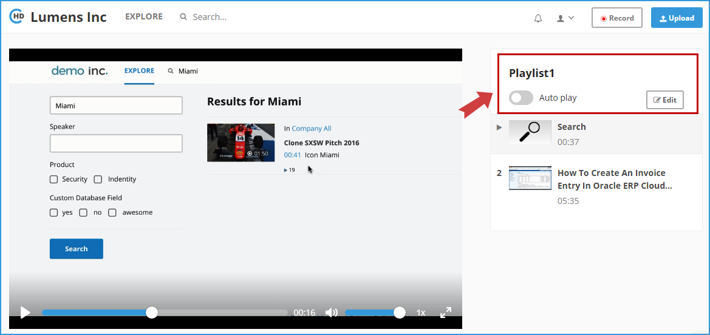
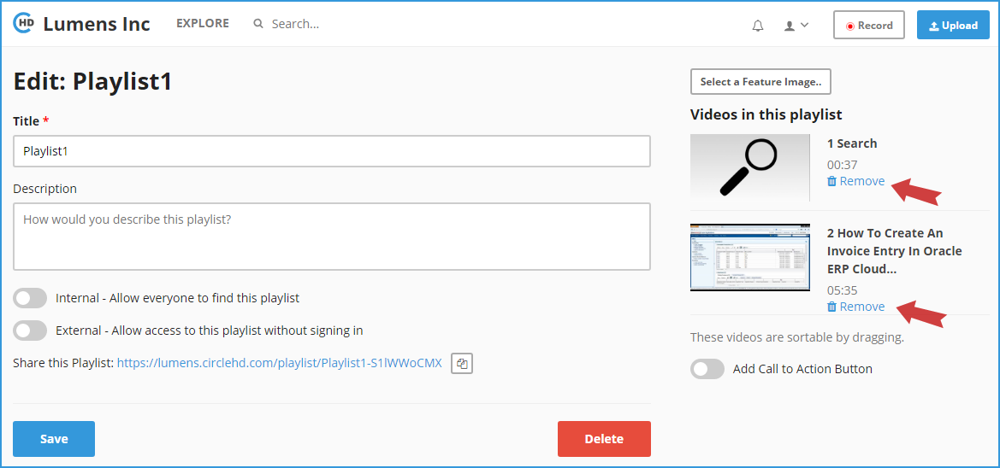

# How do I Delete Videos from Within a Playlist?

**1-** Click on “**Playlists**” in the left vertical menu. This will load all of your playlists and also the public playlists.

**2-** Click on the playlist that you want to edit, under “**Your Playlists**”. This will load the Playlists detail page as below.

**3-** Click on “**Edit**’ button in the right, above the Playlist thumbnail list. This will load the Playlist Edit page. 

**4-** On the Playlist edit page, the video list will be displayed on the right with thumbnails. On the right of each thumbnail, there will be video details and a button “**Remove**” to remove the video from the playlist. Click “**Remove**” button next to the video that you need to remove from playlist. 

**5-** You can click “**Save**” once changes are made. This will take you back to the Playlist detail page with the updates.

