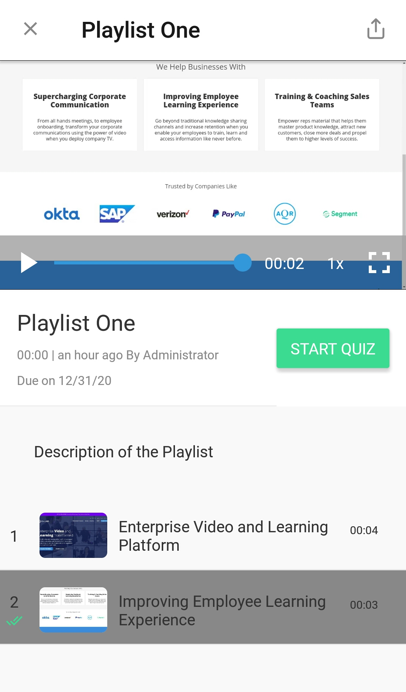
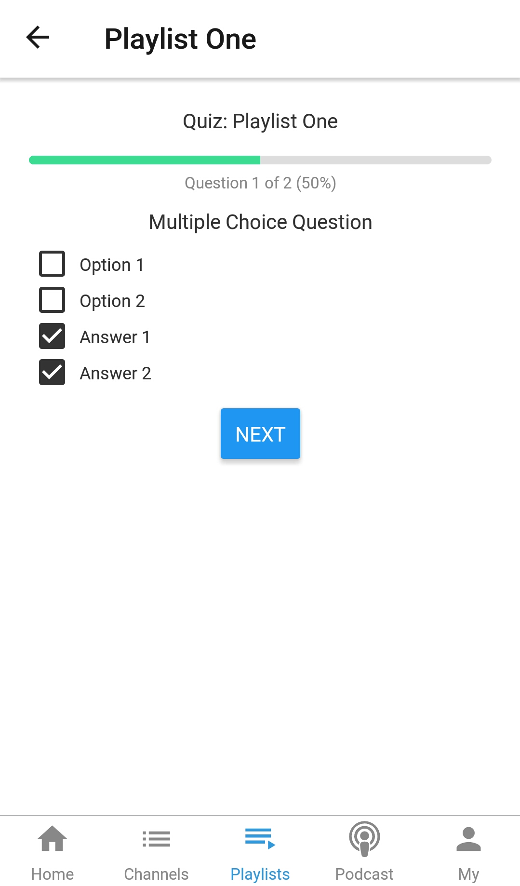
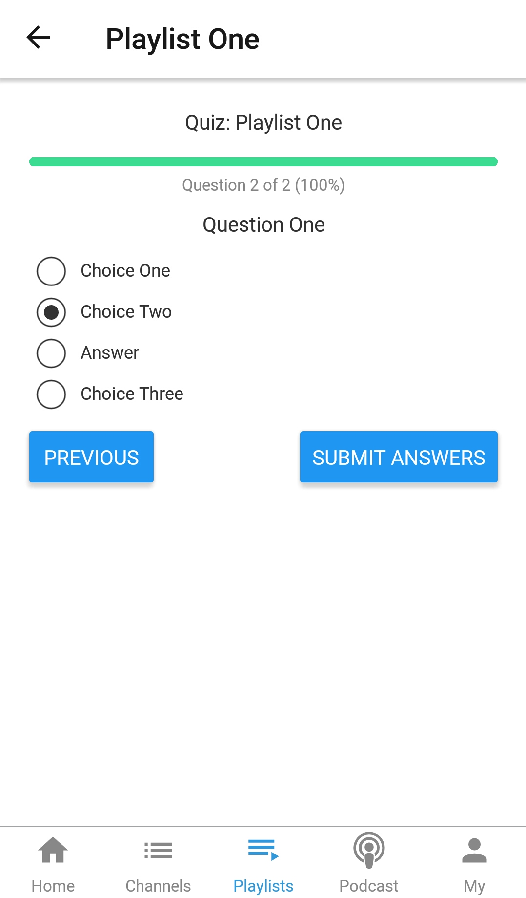
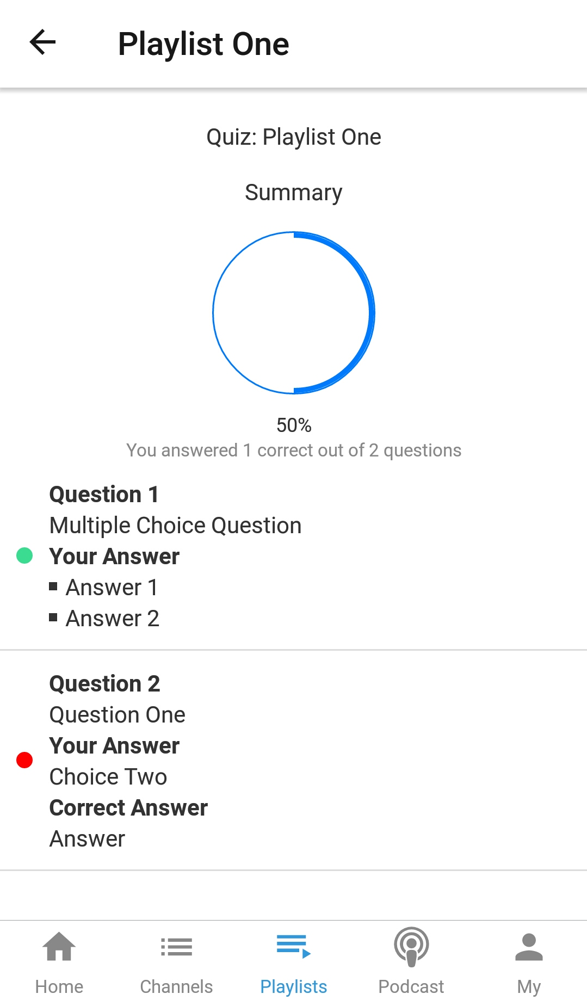

# How to attempt an assigned quiz?

**1-** Click on “**Playlists**” in the left vertical menu. This will load all the playlists added in the Library. Here all the assigned playlists are listed.

**2-** Click on an assigned playlist to attempt the quiz. View playlist page is opened. Here click on **Start Quiz** button to attempt the quiz.

**3-** Once quiz is started, you can see all the optional questions and select the answers.

**4-** Once you select all the answers and click on **Submit Answers** button, Score screen is visible.

### Mobile

**1-** Open the Playlist from the bottom horizontal menu.

**2- '**Assigned' tab shows the list of all the Playlists which are assigned to the logged in user. Touch on a assigned Playlist.

**3-** Here Playlist content is visible. User can open the next video using Next button. If a quiz is created in a playlist, 'Start Quiz' button appears in the last video page. User can attempt the quiz using 'Start Quiz' button.

**4-** Various questions  can be appeared in a quiz. There are objective questions created in a quiz. If a question has multiple answers, mutiple options can be selected.

**5-** Regular question has one answer.

**6**- When user submits answers, Quiz result is visible at last.

