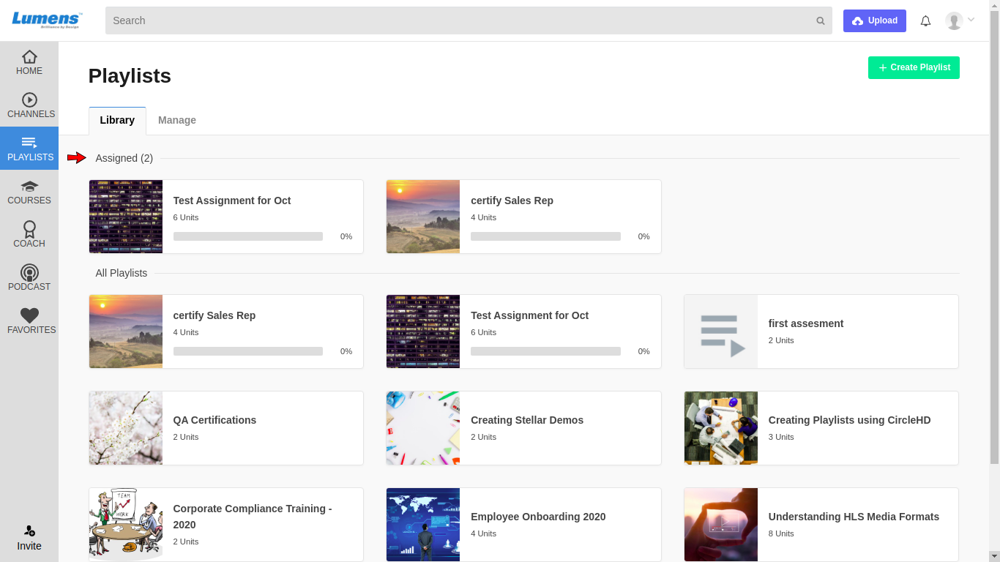
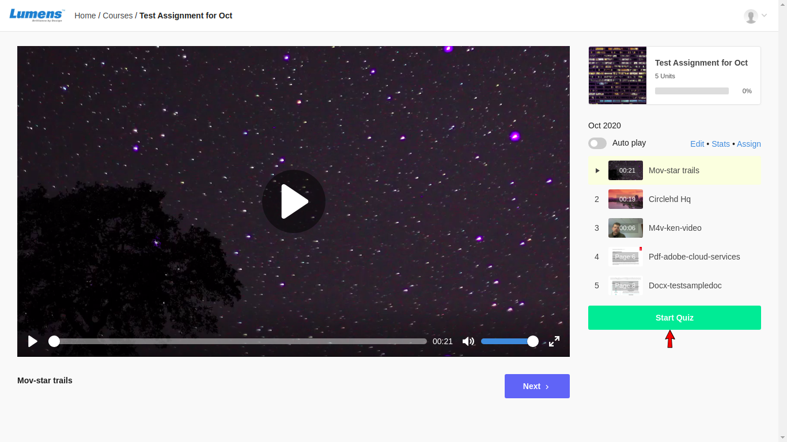
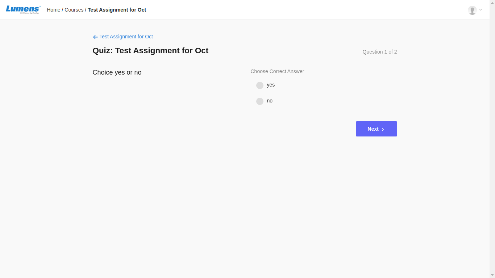
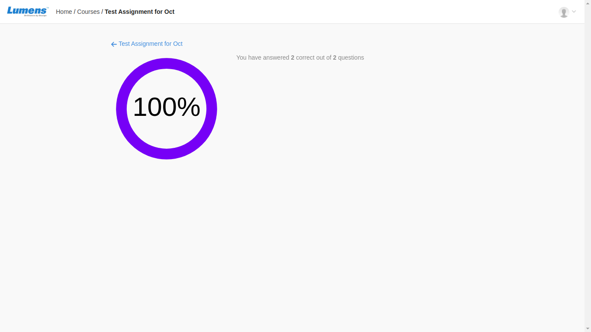

# How to attempt an assigned quiz?

**1-** Click on “**Playlists**” in the left vertical menu. This will load all the playlists added in the Library. Here all the assigned playlists are listed.

**2-** Click on an assigned playlist to attempt the quiz. View playlist page is opened. Here click on **Start Quiz** button to attempt the quiz.

**3-** Once quiz is started, you can see all the optional questions and select the answers.

**4-** Once you select all the answers and click on **Submit Answers** button, Score screen is visible.

