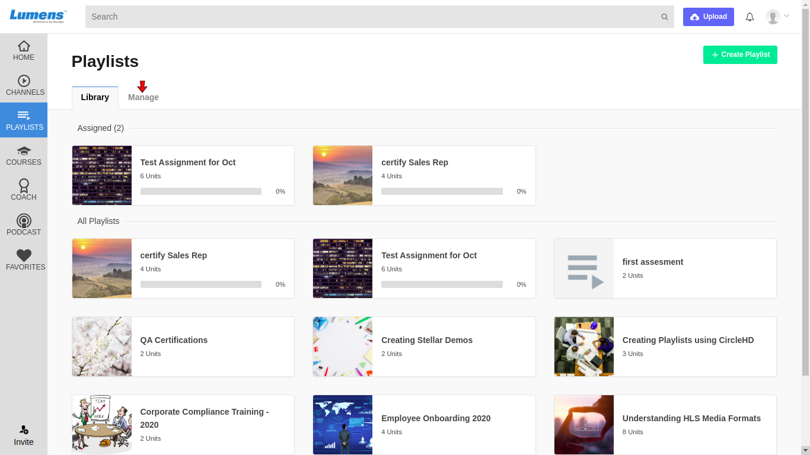
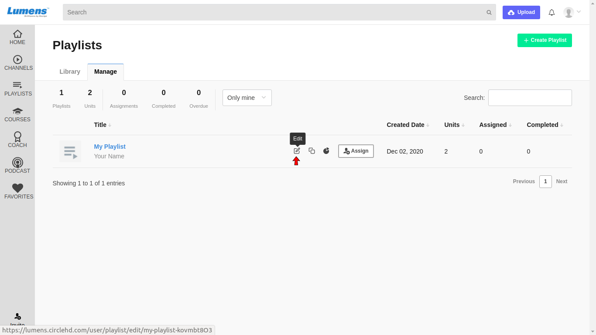

# How to Change The Order of Videos Within a Playlist?

**1-** Click on “**Playlists**” in the left vertical menu. This will load all the playlists added in the Library. Click on Manage to see your created playlists.

**2-** Click on the playlist that you want to edit, under “**Your Playlists**”.  Click on Edit option.

This will load the Edit Playlist page as below.

**3-** On the Playlist edit page, you can **change the video order** by dragging the thumbnails in right with your mouse. 

**4-** You can click “**Save**” once changes are made. This will take you back to the Playlist detail page with the updates.

