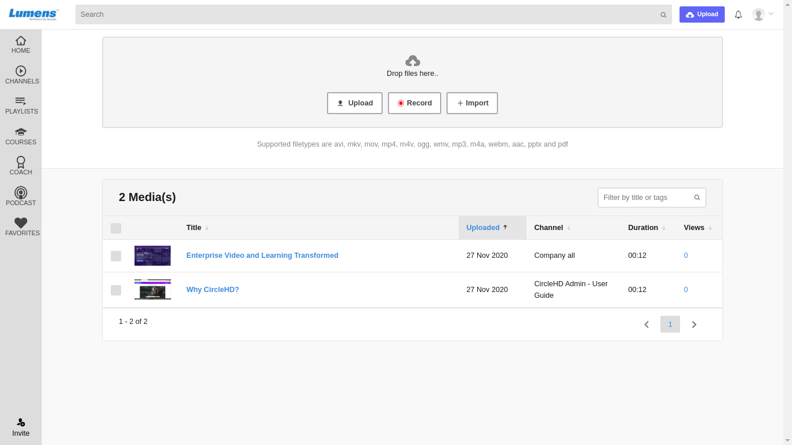
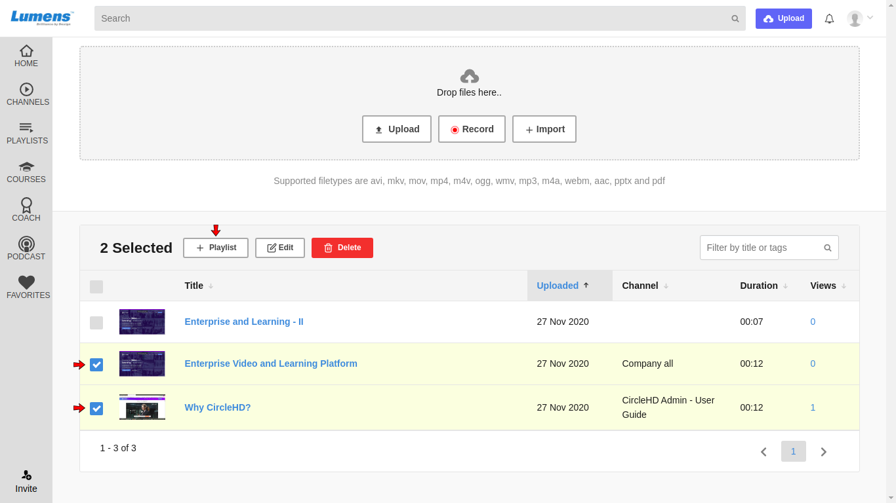
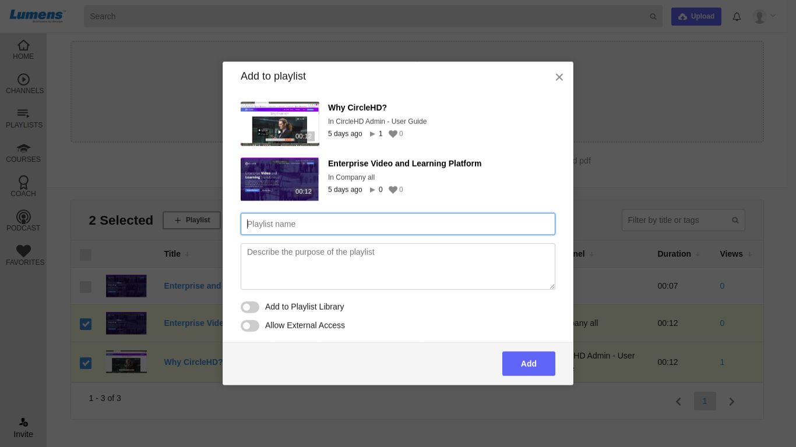

# How to Create a New Playlist?

**1-** Once you are logged into CircleHD portal, you can click on “**My Uploads**” in the left vertical Menu. This will display a list of your uploaded videos.

**2-** Select the videos that you want to add to the new playlist by selecting check boxes on the left of the Video File. 

**3-** Once the videos for the playlist are created, you can click on the button “**+Playlist**” on top, under “**My Uploads**” title.

**4-** You can select an existing playlist from the “**Select a playlist**” drop down, or you can add a new playlist by clicking the “**Create New Playlist**” box and entering the Playlist name below. Click “**Add**” button once details are added. 

**5-** Playlist will be created once you click on “**Add**” button. You can go to your Playlists by clicking on “Playlists” link in the left vertical menu.

